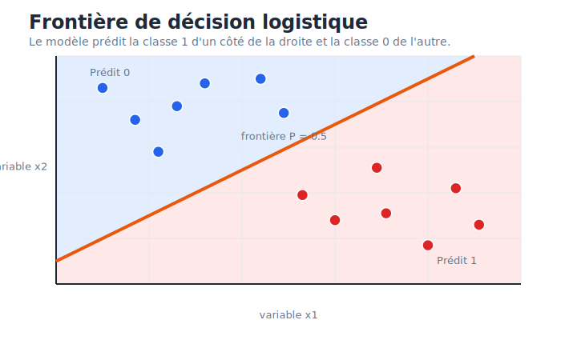
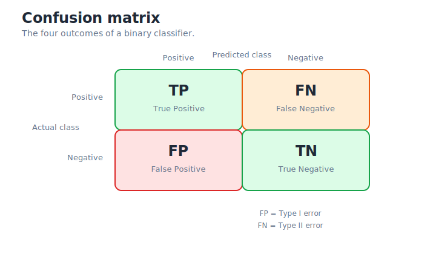
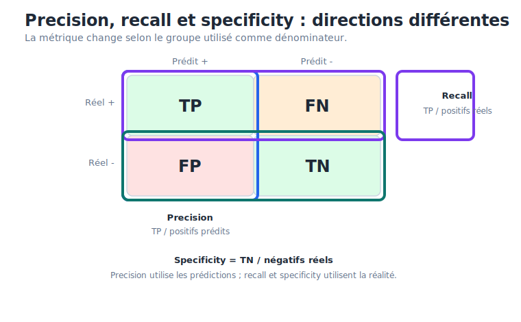
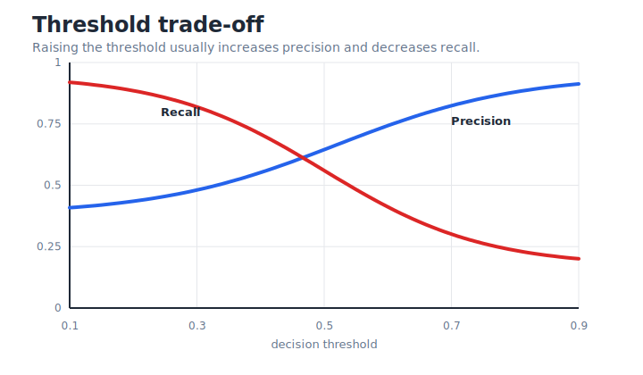
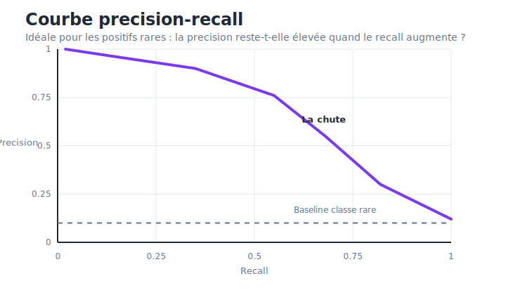
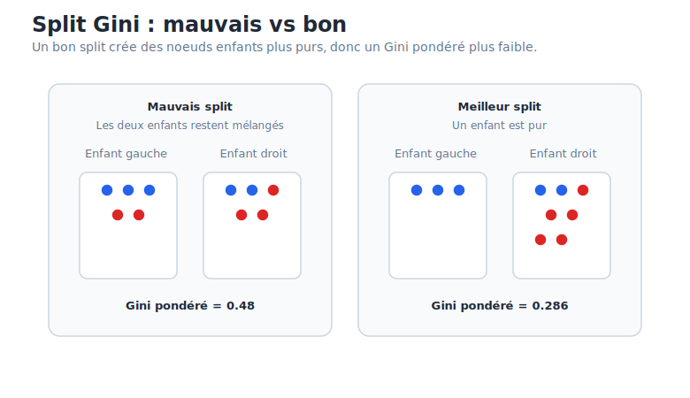
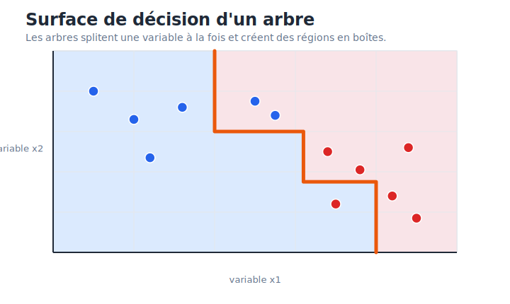
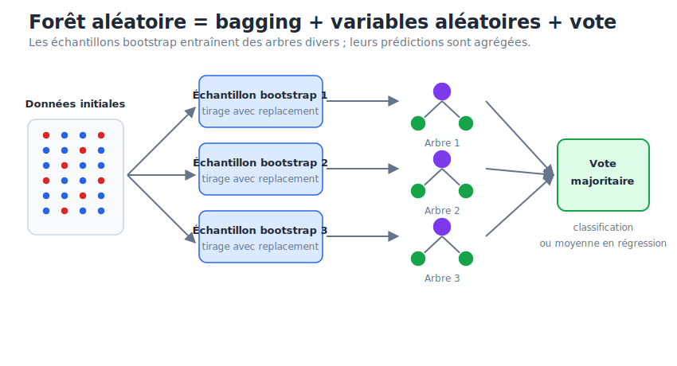
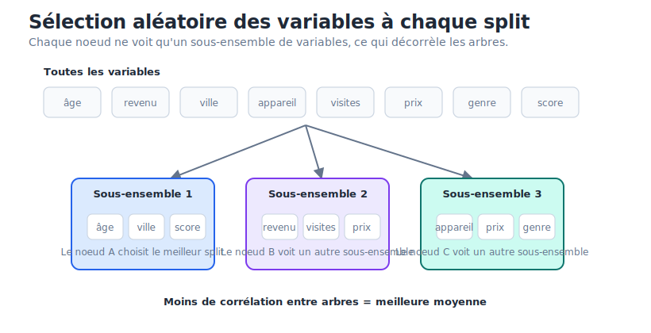
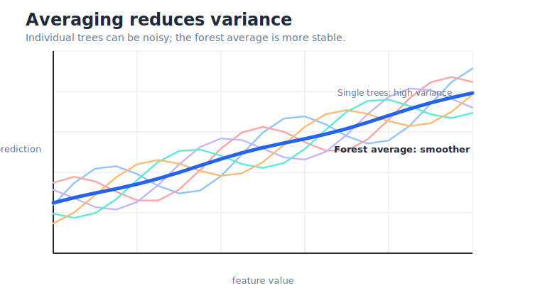

# Guide de révision - Apprentissage supervisé

Ce guide est basé sur le transcript du cours couvrant :

1. La régression logistique
2. Les métriques d'évaluation des modèles
3. Les arbres de décision
4. Les forêts aléatoires

L'objectif n'est pas de répéter les slides mot pour mot. L'objectif est de comprendre ce que chaque concept signifie, comment il fonctionne, dans quels cas l'utiliser, et quels pièges éviter à l'examen.

---

## 1. Vue d'ensemble : apprentissage supervisé

L'apprentissage supervisé signifie que l'on dispose d'exemples pour lesquels la bonne réponse est déjà connue.

- `X` : les variables explicatives, ou variables d'entrée.
- `y` : la cible, ou le label que l'on veut prédire.
- Le modèle apprend une fonction `f(X)` qui prédit `y`.

En classification, `y` est catégorielle :

- Classification binaire : deux classes, par exemple fraude/non-fraude, churn/reste, malade/sain.
- Classification multi-classe : plus de deux classes, par exemple reconnaissance de chiffres de 0 à 9.

Workflow typique de machine learning :

1. Définir le problème et l'objectif.
2. Collecter des données représentatives.
3. Séparer les données en train/test pour éviter la fuite de données.
4. Préparer les données : nettoyage, encodage, mise à l'échelle, feature engineering.
5. Entraîner un modèle.
6. L'évaluer avec des métriques adaptées au problème métier.
7. Le déployer et le surveiller.

Idée clé : un score élevé n'est utile que si la métrique correspond au vrai objectif. Par exemple, l'accuracy peut être trompeuse pour des événements rares comme la fraude.

---

## 2. Régression logistique

### Ce que c'est

Malgré son nom, la régression logistique est un modèle de classification.

Elle prédit la probabilité qu'une observation appartienne à la classe `1` :

```text
P(y = 1 | X)
```

C'est un modèle linéaire, car il suppose que les log-odds de la classe positive sont une combinaison linéaire des variables explicatives.

Il faut souvent l'utiliser comme modèle de référence, car il est :

- Rapide à entraîner.
- Facile à interpréter.
- Solide sur des problèmes simples ou principalement linéaires.
- Utile lorsque l'explicabilité compte, par exemple en scoring de crédit ou en analyse de facteurs de risque médicaux.

### Pourquoi on utilise la fonction sigmoïde

Un modèle linéaire peut produire n'importe quelle valeur entre `-infinity` et `+infinity` :

```text
z = beta_0 + beta_1 x_1 + ... + beta_p x_p
```

Mais une probabilité doit rester entre `0` et `1`.

La régression logistique transforme donc le score linéaire `z` avec la fonction sigmoïde :

```text
sigma(z) = 1 / (1 + exp(-z))
```

Ce qui donne :

```text
P(y = 1 | X) = sigma(beta_0 + beta_1 x_1 + ... + beta_p x_p)
```

La sigmoïde est appropriée parce que :

- Sa sortie est toujours comprise entre `0` et `1`.
- Elle est lisse et dérivable, donc l'optimisation par gradient fonctionne.
- Elle est l'inverse du logit, qui vient de l'hypothèse des log-odds.


### Odds et log-odds

Probabilité :

```text
p = P(y = 1)
```

Odds :

```text
odds = p / (1 - p)
```

Log-odds, aussi appelés logit :

```text
log(odds) = log(p / (1 - p))
```

La régression logistique suppose que :

```text
log(p / (1 - p)) = beta_0 + beta_1 x_1 + ... + beta_p x_p
```

La régression logistique est donc une régression linéaire sur les log-odds, pas directement sur la probabilité.

### Frontière de décision

Par défaut, la régression logistique prédit la classe `1` lorsque :

```text
P(y = 1 | X) > 0.5
```

Comme `sigmoid(0) = 0.5`, la frontière de décision est l'ensemble des points où :

```text
beta_0 + beta_1 x_1 + ... + beta_p x_p = 0
```

En 2D, c'est une droite. En dimension plus élevée, c'est un hyperplan.

Cela explique la principale limite de la régression logistique : elle trace une frontière linéaire. Si le vrai motif est circulaire, en damier, ou fortement non linéaire, la régression logistique a besoin de feature engineering ou doit être remplacée par un modèle non linéaire.



### Interpréter les coefficients

Chaque coefficient modifie les log-odds.

Si `x_j` augmente d'une unité :

```text
les log-odds augmentent de beta_j
les odds sont multipliées par exp(beta_j)
```

Interprétation :

- Si `beta_j > 0`, la variable augmente les odds de la classe `1`.
- Si `beta_j < 0`, la variable diminue les odds de la classe `1`.
- Si `exp(beta_j) = 2`, les odds sont multipliées par 2.
- Si `exp(beta_j) = 0.5`, les odds sont divisées par 2.

Exemple :

```text
beta_age = -0.04
exp(-0.04) = 0.96
```

Pour chaque année supplémentaire, les odds sont multipliées par `0.96`, ce qui signifie qu'elles diminuent d'environ 4 %, toutes choses égales par ailleurs.

Phrase importante pour l'examen : "toutes choses égales par ailleurs" compte, car le coefficient s'interprète en gardant les autres variables constantes.

### Fonction de perte : pourquoi pas la MSE ?

En classification binaire, la cible suit une distribution de Bernoulli :

```text
y in {0, 1}
```

La bonne fonction de perte est la binary cross-entropy, aussi appelée log-loss :

```text
J(beta) = -(1/n) * sum[ y_i log(yhat_i) + (1 - y_i) log(1 - yhat_i) ]
```

Elle vient de l'estimation par maximum de vraisemblance pour une variable de Bernoulli.

La MSE n'est pas la bonne perte pour la régression logistique parce que :

- La MSE suppose des erreurs gaussiennes, pas des résultats de Bernoulli.
- MSE + sigmoïde peut créer une optimisation non convexe.
- La MSE peut souffrir de gradients qui disparaissent lorsque le modèle est confiant mais faux.

Avec la cross-entropy, une prédiction très confiante mais fausse est fortement pénalisée, donc le modèle reçoit un grand signal correctif.

### Entraînement

Il n'existe pas de solution fermée simple comme en régression linéaire ordinaire. La régression logistique est entraînée par optimisation itérative.

Règle de mise à jour générale :

```text
beta_new = beta_old - learning_rate * gradient
```

Le gradient a la forme intuitive suivante :

```text
sum( (yhat_i - y_i) * x_ij )
```

Cela signifie que le modèle ajuste chaque coefficient selon :

- L'erreur de prédiction.
- La valeur de la variable correspondante.

### Mise à l'échelle des variables

La régression logistique doit généralement utiliser des variables standardisées :

```text
x_scaled = (x - mean) / standard_deviation
```

Pourquoi :

- L'optimisation par gradient est sensible à l'échelle des variables.
- Une variable comme le salaire peut aller de 20 000 à 100 000, alors que l'âge va de 18 à 80.
- Sans mise à l'échelle, l'optimisation peut être lente ou instable.

La mise à l'échelle rend aussi les coefficients plus comparables lorsque les variables sont mesurées dans des unités différentes.

### Régression logistique multi-classe

Lorsqu'il y a plus de deux classes, il existe deux stratégies principales.

#### One-vs-Rest

On entraîne un classifieur binaire par classe :

```text
Classe A vs non A
Classe B vs non B
Classe C vs non C
```

Au moment de prédire, on choisit la classe avec le score le plus élevé.

Avantage : simple et compatible avec n'importe quel classifieur binaire.

#### Multinomiale / Softmax

Softmax produit directement une distribution de probabilité sur toutes les classes :

```text
P(y = k | X) = exp(z_k) / sum_j exp(z_j)
```

Propriétés :

- Chaque probabilité de classe est positive.
- Toutes les probabilités somment à 1.
- La perte est la categorical cross-entropy.

### Quand utiliser la régression logistique

Utiliser la régression logistique lorsque :

- On a besoin d'un modèle de référence simple et solide.
- L'interprétabilité est importante.
- La relation est approximativement linéaire dans les log-odds.
- Le dataset est petit ou de taille moyenne.
- On a besoin de probabilités, pas seulement de labels.
- On est dans un contexte réglementé où les décisions doivent être expliquées.

Éviter de se reposer uniquement sur la régression logistique lorsque :

- La frontière de décision est fortement non linéaire.
- Les interactions entre variables sont complexes et non construites manuellement.
- La performance prédictive compte beaucoup plus que l'interprétabilité.

### Pièges d'examen sur la régression logistique

- C'est un modèle de classification, pas un modèle de régression.
- Elle est linéaire dans les log-odds, pas dans la probabilité.
- Le seuil par défaut `0.5` n'est pas sacré ; il peut être ajusté.
- L'accuracy ne suffit pas pour l'évaluer sur des données déséquilibrées.
- Les coefficients affectent les odds de façon multiplicative via `exp(beta_j)`.
- La mise à l'échelle des variables est importante pour l'optimisation.

---

## 3. Métriques d'évaluation

### La matrice de confusion

Pour une classification binaire :

| Réalité / Prédiction | Prédit positif | Prédit négatif |
| --- | --- | --- |
| Réel positif | True Positive (TP) | False Negative (FN) |
| Réel négatif | False Positive (FP) | True Negative (TN) |

Signification :

- TP : prédit positif et c'était réellement positif.
- TN : prédit négatif et c'était réellement négatif.
- FP : prédit positif mais c'était négatif. C'est une fausse alerte.
- FN : prédit négatif mais c'était positif. C'est une détection manquée.

Terminologie statistique :

- Erreur de type I = False Positive.
- Erreur de type II = False Negative.



### Accuracy

```text
Accuracy = (TP + TN) / (TP + TN + FP + FN)
```

L'accuracy répond à la question :

```text
Quelle proportion de toutes les prédictions était correcte ?
```

L'accuracy est utile lorsque les classes sont équilibrées et que les coûts d'erreur sont similaires.

Elle est dangereuse sur des données déséquilibrées. Exemple : si la fraude représente 0,1 % du dataset, un modèle qui prédit toujours "non-fraude" obtient 99,9 % d'accuracy tout en détectant zéro fraude.

### Precision

```text
Precision = TP / (TP + FP)
```

La precision répond à la question :

```text
Lorsque le modèle prédit positif, à quelle fréquence a-t-il raison ?
```

Une precision élevée signifie peu de faux positifs.

Utiliser la precision lorsque les faux positifs coûtent cher.

Exemples :

- Filtre anti-spam : ne pas mettre des emails importants dans les spams.
- Système de recommandation : ne pas recommander des éléments non pertinents.
- Système de bannissement automatique : éviter de bannir des utilisateurs innocents.

### Recall

```text
Recall = TP / (TP + FN)
```

Le recall est aussi appelé sensibilité ou true positive rate.

Le recall répond à la question :

```text
Parmi tous les vrais positifs, combien le modèle en a-t-il trouvés ?
```

Un recall élevé signifie peu de faux négatifs.

Utiliser le recall lorsque rater un cas positif coûte cher.

Exemples :

- Dépistage du cancer.
- Détection de fraude.
- Détection de sécurité ou de sûreté.

### Specificity

```text
Specificity = TN / (TN + FP)
```

La specificity répond à la question :

```text
Parmi tous les vrais négatifs, combien le modèle a-t-il correctement rejetés ?
```

Une specificity élevée signifie que le modèle évite les fausses alertes parmi les négatifs.

Relation :

```text
False Positive Rate = 1 - Specificity = FP / (FP + TN)
```

### Precision vs recall vs specificity

Ces métriques ont des dénominateurs différents :

| Métrique | Formule | Dénominateur | Question principale |
| --- | --- | --- | --- |
| Precision | `TP / (TP + FP)` | Positifs prédits | Les prédictions positives sont-elles fiables ? |
| Recall | `TP / (TP + FN)` | Positifs réels | A-t-on trouvé les vrais positifs ? |
| Specificity | `TN / (TN + FP)` | Négatifs réels | A-t-on correctement rejeté les négatifs ? |

Règles d'or :

- Le recall mesure la performance sur les positifs réels.
- La specificity mesure la performance sur les négatifs réels.
- La precision mesure la qualité des prédictions positives.



### Compromis precision-recall

La plupart des classifieurs produisent d'abord un score ou une probabilité, puis appliquent un seuil.

Pour la régression logistique :

```text
predict positive if P(y = 1 | X) > threshold
```

Si le seuil augmente :

- Il devient plus difficile de prédire positif.
- La precision augmente généralement.
- Le recall diminue généralement.

Si le seuil diminue :

- Il devient plus facile de prédire positif.
- Le recall augmente généralement.
- La precision diminue généralement.

Le seuil doit être choisi selon le coût des erreurs, pas automatiquement laissé à `0.5`.



### F1-score

Le F1 combine precision et recall :

```text
F1 = 2 * (Precision * Recall) / (Precision + Recall)
```

C'est la moyenne harmonique de la precision et du recall.

Pourquoi la moyenne harmonique ?

- Elle pénalise les déséquilibres.
- Si la precision est élevée mais que le recall est proche de zéro, le F1 est proche de zéro.
- Si le recall est élevé mais que la precision est proche de zéro, le F1 est proche de zéro.

Utiliser le F1 lorsque :

- On a besoin d'une seule métrique.
- La precision et le recall sont tous les deux importants.
- Les classes sont déséquilibrées.

Ne pas utiliser le F1 aveuglément si le coût métier des FP et des FN n'est pas équilibré.

### F-beta score

Le F-beta généralise le F1 :

```text
F_beta = (1 + beta^2) * (Precision * Recall) / ((beta^2 * Precision) + Recall)
```

Interprétation :

- `beta = 1` : équilibre entre precision et recall.
- `beta < 1` : plus d'importance à la precision.
- `beta > 1` : plus d'importance au recall.

Exemples :

- `F_0.5` : utile lorsque les faux positifs sont particulièrement coûteux.
- `F_2` : utile lorsque les faux négatifs sont particulièrement coûteux.

Piège d'examen :

Quand `beta > 1`, F-beta met l'accent sur le recall même si le dénominateur contient `beta^2 * Precision`. Cela vient du fait que F-beta est une moyenne harmonique pondérée. Le poids est appliqué à l'inverse du recall, puis apparaît à côté de la precision après réarrangement algébrique.

### Choix du seuil par coût métier

Le meilleur seuil est souvent celui qui minimise le coût métier attendu :

```text
Total Cost = FP * Cost(FP) + FN * Cost(FN)
```

Exemple :

- Fraude manquée : `Cost(FN) = 1000`
- Transaction légitime bloquée : `Cost(FP) = 10`

Dans ce cas, on préfère généralement un recall plus élevé, car les faux négatifs sont beaucoup plus coûteux.

### Courbe ROC

ROC signifie Receiver Operating Characteristic.

Elle trace les performances du modèle pour tous les seuils possibles :

- Axe X : False Positive Rate = `FP / (FP + TN)` = `1 - specificity`.
- Axe Y : True Positive Rate = recall = `TP / (TP + FN)`.

Comment la lire :

- Le coin en haut à gauche est idéal : recall élevé, false positive rate faible.
- La diagonale représente une prédiction aléatoire.
- La courbe doit monter rapidement avant d'aller vers la droite.


### AUC

L'AUC est l'aire sous la courbe ROC.

Interprétation :

- `AUC = 0.5` : classement aléatoire.
- `AUC = 1.0` : classement parfait.
- `AUC = 0.8` à `0.9` : souvent considéré comme bon.

Interprétation importante :

```text
AUC = probabilité qu'un positif choisi au hasard reçoive un score plus élevé qu'un négatif choisi au hasard.
```

L'AUC mesure la qualité du ranking, pas la calibration.

La calibration demande :

```text
Si le modèle annonce une probabilité de 0.80, l'événement arrive-t-il environ 80 % du temps ?
```

Deux modèles peuvent avoir la même AUC même si l'un produit des probabilités utiles et l'autre des scores compressés comme `0.51` et `0.49`.

### Courbe precision-recall

Une courbe precision-recall trace :

- Axe X : recall.
- Axe Y : precision.

Le point idéal est en haut à droite :

```text
Recall = 1 and Precision = 1
```

La baseline aléatoire est :

```text
taux de classe positive = nombre de positifs / nombre total d'exemples
```

Utiliser les courbes PR lorsque :

- La classe positive est rare.
- On veut fortement trouver les positifs.
- La precision chute rapidement lorsque l'on augmente le recall.

Pour la fraude, le cancer, la détection d'anomalies ou les événements rares, les courbes PR sont souvent plus informatives que les courbes ROC.



### ROC vs courbe PR

| Situation | Préférer |
| --- | --- |
| Classes équilibrées | ROC peut être utile |
| Les vrais négatifs comptent beaucoup | ROC peut être utile |
| La classe positive est rare | Courbe PR généralement meilleure |
| On s'intéresse à precision et recall | Courbe PR |
| On s'intéresse au ranking des positifs au-dessus des négatifs | AUC-ROC |

### Métriques multi-classes

Pour une classification multi-classe, on calcule les métriques classe par classe en One-vs-Rest, puis on les moyenne.

Macro average :

- Calculer la métrique pour chaque classe.
- Prendre la moyenne simple.
- Traite toutes les classes de la même façon.
- Utile lorsque les classes minoritaires comptent.

Weighted average :

- Calculer la métrique pour chaque classe.
- Pondérer chaque classe par son nombre d'exemples réels.
- Peut cacher une mauvaise performance sur les classes rares.

Piège d'examen : sur des données multi-classes déséquilibrées, le F1 pondéré peut sembler bon même si le modèle échoue sur la classe minoritaire. Le macro F1 est plus strict.

---

## 4. Arbres de décision

### Ce que c'est

Un arbre de décision est un algorithme d'apprentissage supervisé pour la classification ou la régression.

Il prédit en posant une suite de questions :

```text
Is age <= 30?
Is income > 50000?
Is tumor size <= 2.5?
```

Structure :

- Noeud racine : le premier split, représentant tout le dataset.
- Noeud interne : une règle de décision.
- Branche : le chemin d'un noeud vers un autre.
- Feuille : la prédiction finale.

En classification, la feuille prédit une classe.

En régression, la feuille prédit une valeur numérique, généralement la moyenne de la cible des observations d'entraînement présentes dans cette feuille.


### Comment CART construit un arbre de classification

CART signifie Classification and Regression Trees.

À chaque noeud, CART cherche le meilleur split.

Pour les variables numériques :

1. Trier les valeurs uniques.
2. Calculer les points milieux entre valeurs consécutives.
3. Tester chaque point milieu comme seuil.
4. Séparer les données en groupe gauche et groupe droit.
5. Calculer l'impureté du split.
6. Choisir le split avec l'impureté pondérée la plus faible.

Le processus se répète récursivement jusqu'à atteindre une condition d'arrêt.

Important : CART est glouton.

Cela signifie qu'il choisit le meilleur split maintenant, pas nécessairement le split qui mènerait au meilleur arbre global plus tard. Cela rend les arbres rapides, mais pas globalement optimaux.

### Impureté de Gini

L'impureté de Gini mesure à quel point un noeud est mélangé.

Pour un noeud `D` avec `c` classes :

```text
Gini(D) = 1 - sum_i p_i^2
```

où `p_i` est la proportion de la classe `i` dans le noeud.

Interprétation :

- `Gini = 0` : noeud pur, toutes les observations ont la même classe.
- Gini plus élevé : noeud plus mélangé.
- En classification binaire, le Gini maximal est `0.5`, lorsque les classes sont réparties 50/50.

Gini pondéré après un split :

```text
Gini_split = (|D_left| / |D|) * Gini(D_left)
           + (|D_right| / |D|) * Gini(D_right)
```

Le meilleur split est celui avec le `Gini_split` le plus faible.



### Entropie et information gain

L'entropie est une autre mesure d'impureté :

```text
H(D) = - sum_i p_i log2(p_i)
```

L'information gain mesure la baisse d'entropie après un split :

```text
IG(D, split) = H(D) - weighted_child_entropy
```

Comparaison :

- Gini est plus rapide car il n'utilise pas de logarithmes.
- L'entropie peut produire des arbres légèrement plus équilibrés.
- En pratique, les résultats sont souvent similaires.

### Arbres de régression

Les arbres de régression prédisent des valeurs continues.

Au lieu de minimiser l'impureté de Gini, ils minimisent la mean squared error.

Pour un noeud `t` :

```text
MSE(t) = (1 / |D_t|) * sum_{i in D_t} (y_i - mean_y_t)^2
```

Un split est bon s'il réduit la MSE pondérée des noeuds enfants.

Prédiction dans une feuille :

```text
valeur prédite = moyenne de la cible des observations d'entraînement dans cette feuille
```

Limite importante : les arbres de régression extrapolent mal. S'ils sont entraînés uniquement sur des logements de 30m2 à 110m2, ils ne peuvent pas prédire de façon fiable les prix pour 150m2, car ils ne font que moyenner des valeurs vues dans les feuilles.

### Frontières de décision

Les arbres de décision créent des frontières alignées avec les axes.

En 2D, ils splitent sous la forme :

```text
x_1 <= threshold
x_2 <= threshold
```

Leurs régions de décision ressemblent donc à des rectangles ou à des marches.

Comparaison :

- La régression logistique trace une droite diagonale ou un hyperplan.
- Les arbres de décision tracent des régions en boîtes.

Pour approximer une frontière diagonale, un arbre peut avoir besoin de nombreux petits splits, ce qui peut mener à l'overfitting.



### Élagage et régularisation

Les arbres de décision peuvent facilement overfitter s'ils deviennent trop profonds.

#### Pré-élagage

Le pré-élagage arrête l'arbre tôt.

Hyperparamètres courants :

- `max_depth` : profondeur maximale de l'arbre.
- `min_samples_split` : nombre minimum d'échantillons nécessaires pour splitter un noeud.
- `min_samples_leaf` : nombre minimum d'échantillons requis dans une feuille.
- `max_leaf_nodes` : nombre maximum de feuilles.

Si l'arbre est arrêté trop tôt, il underfit. S'il grandit trop, il overfit.

#### Post-élagage : cost complexity pruning

Le post-élagage construit d'abord l'arbre, puis retire les branches inutiles.

Le cost complexity pruning utilise :

```text
R_alpha(T) = R(T) + alpha * |T|
```

où :

- `R(T)` est l'impureté ou l'erreur de l'arbre.
- `|T|` est le nombre de feuilles.
- `alpha` contrôle la pénalité de complexité.

Plus `alpha` est élevé, plus l'élagage est fort et plus l'arbre est petit.

En scikit-learn :

```python
DecisionTreeClassifier(ccp_alpha=0.01)
```

### Importance des variables dans les arbres de décision

Les arbres de décision peuvent calculer l'importance des variables via la réduction d'impureté.

Une variable est importante si :

- Elle est souvent utilisée dans les splits.
- Les splits où elle est utilisée réduisent fortement l'impureté.
- Ces splits concernent beaucoup d'observations.

Idée générale :

```text
Importance(feature) = somme des diminutions d'impureté pondérées causées par cette variable
```

Cela s'appelle Mean Decrease in Impurity, ou MDI.

### Quand utiliser les arbres de décision

Utiliser les arbres de décision lorsque :

- On veut des règles interprétables de type if/then.
- La relation est non linéaire.
- Il existe des interactions entre variables.
- On veut peu de preprocessing comparé aux modèles linéaires.
- On a besoin d'un modèle qui fonctionne en classification ou en régression.

Être prudent lorsque :

- L'arbre est très profond.
- Le dataset est bruité.
- De petits changements dans les données produisent un arbre très différent.
- On a besoin d'estimations de probabilité lisses.
- On a besoin d'extrapolation en régression.

### Pièges d'examen sur les arbres de décision

- Un arbre de décision est glouton, pas globalement optimal.
- L'impureté de Gini mesure l'impureté d'un noeud, pas l'accuracy du modèle.
- Le meilleur split est celui avec l'impureté pondérée des enfants la plus faible.
- Les arbres peuvent fortement overfitter sans élagage ou contrainte de profondeur.
- Les frontières des arbres sont alignées avec les axes, pas diagonales.
- Les arbres de régression prédisent des moyennes dans les feuilles ; ils n'extrapolent pas naturellement.

---

## 5. Forêts aléatoires

### Ce que c'est

Une forêt aléatoire est un ensemble d'arbres de décision.

Au lieu de dépendre d'un seul arbre, elle entraîne beaucoup d'arbres et combine leurs prédictions.

Pour la classification :

```text
prédiction finale = vote majoritaire des arbres
```

Pour la régression :

```text
prédiction finale = moyenne des prédictions des arbres
```

Le but est de réduire la forte variance des arbres de décision individuels.

### Intuition des ensembles

Un seul arbre de décision peut être instable. De petits changements dans les données d'entraînement peuvent produire un arbre très différent.

Une forêt aléatoire réduit cette instabilité en combinant beaucoup d'arbres.

La "sagesse des foules" fonctionne lorsque :

- Chaque arbre est meilleur qu'une prédiction aléatoire.
- Les arbres font des erreurs différentes.
- Les arbres ne sont pas trop corrélés entre eux.

Si tous les arbres sont identiques, le vote n'aide pas. La diversité est essentielle.

### Weak learners et strong learners

Un weak learner est un modèle qui fait seulement un peu mieux qu'une prédiction aléatoire.

Un strong learner est un modèle qui atteint une forte performance prédictive.

L'idée des méthodes d'ensemble est de combiner plusieurs modèles faibles ou instables pour construire un modèle plus fort. Une forêt aléatoire le fait en combinant beaucoup d'arbres de décision.

### Grandes familles d'ensembles

Bagging :

- Entraîne les modèles en parallèle sur différents échantillons bootstrap.
- Réduit la variance.
- Exemple : random forest.

Boosting :

- Entraîne les modèles séquentiellement.
- Chaque nouveau modèle se concentre davantage sur les erreurs précédentes.
- Réduit principalement le biais.
- Exemples : AdaBoost, XGBoost, LightGBM.

Stacking :

- Entraîne plusieurs modèles de base différents.
- Entraîne ensuite un méta-modèle final pour combiner leurs prédictions.

La forêt aléatoire appartient à la famille du bagging.

### Bagging : bootstrap aggregating

Le bagging crée beaucoup de jeux d'entraînement différents à partir des données originales.

Pour chaque arbre :

1. Échantillonner `n` lignes depuis le train set de taille `n`.
2. Échantillonner avec replacement, donc la même ligne peut apparaître plusieurs fois.
3. Entraîner un arbre sur cet échantillon bootstrap.

Comme l'échantillonnage se fait avec replacement :

- Environ 63,2 % des observations uniques apparaissent dans un échantillon bootstrap donné.
- Environ 36,8 % sont laissées de côté pour cet arbre.

Les observations laissées de côté sont appelées out-of-bag samples.



### Validation out-of-bag

Pour chaque observation, certains arbres ne l'ont pas vue pendant l'entraînement.

La validation OOB prédit cette observation uniquement avec les arbres pour lesquels elle était out-of-bag.

Cela donne une estimation de validation naturelle sans avoir besoin d'un split de validation séparé.

En scikit-learn :

```python
RandomForestClassifier(oob_score=True)
```

L'OOB est utile, mais cela ne signifie pas qu'un test set est inutile. Un test set final reste important pour une évaluation finale non biaisée.

### Sélection aléatoire des variables

Une forêt aléatoire ajoute une deuxième source d'aléatoire : à chaque split, chaque arbre ne considère qu'un sous-ensemble aléatoire de variables.

C'est crucial.

Sans sélection aléatoire des variables, si une variable est très forte, la plupart des arbres l'utiliseront près du sommet. Les arbres deviennent similaires et leurs erreurs deviennent corrélées.

La sélection aléatoire des variables force les arbres à explorer différents prédicteurs. Cela décorrèle les arbres et améliore la forêt.

Règles pratiques du cours :

- Classification : utiliser environ `sqrt(d)` variables à chaque split.
- Régression : utiliser environ `d / 3` variables à chaque split.

où `d` est le nombre total de variables.



### Pourquoi la moyenne réduit la variance

Si l'on moyenne `B` modèles indépendants, chacun avec une variance `sigma^2` :

```text
Variance(mean) = sigma^2 / B
```

Donc plus il y a d'arbres indépendants, plus la variance diminue.

Mais les arbres ne sont pas parfaitement indépendants. Si leur corrélation est `rho`, la variance de la forêt est :

```text
Variance(forest) = rho * sigma^2 + ((1 - rho) / B) * sigma^2
```

Cette formule explique les forêts aléatoires :

- Augmenter `B` aide.
- Mais si `rho` est élevé, l'amélioration est limitée.
- La sélection aléatoire des variables diminue `rho`.



### Algorithme de la forêt aléatoire

Entraînement :

1. Choisir le nombre d'arbres `B`.
2. Pour chaque arbre :
   - Tirer un échantillon bootstrap depuis les données d'entraînement.
   - Faire pousser un arbre de décision.
   - À chaque noeud, sélectionner aléatoirement `m` variables candidates.
   - Choisir le meilleur split parmi ces `m` variables avec Gini ou MSE.
   - Continuer jusqu'à atteindre une règle d'arrêt.

Prédiction :

- Classification : chaque arbre vote, et la classe majoritaire gagne.
- Régression : on moyenne les prédictions des arbres.

### Hyperparamètres importants

`n_estimators` :

- Nombre d'arbres.
- Plus d'arbres réduit généralement la variance.
- Plus d'arbres augmente aussi le temps d'entraînement et la mémoire.
- La performance finit par se stabiliser.

`max_features` :

- Nombre de variables considérées à chaque split.
- Des valeurs plus petites augmentent la diversité des arbres mais peuvent augmenter le biais.
- Des valeurs plus grandes rendent les arbres individuellement plus forts mais plus corrélés.

`max_depth` :

- Profondeur maximale de l'arbre.
- Contrôle la complexité des arbres individuels.

`min_samples_leaf` :

- Nombre minimum d'échantillons par feuille.
- Des valeurs plus grandes lissent le modèle et réduisent l'overfitting.

`oob_score` :

- Active la validation out-of-bag.

`n_jobs` :

- Permet l'entraînement parallèle.
- `n_jobs=-1` utilise tous les coeurs CPU disponibles.

### Importance des variables dans les forêts aléatoires

Les forêts aléatoires rapportent souvent l'importance MDI des variables.

Pour chaque arbre, l'importance est la diminution d'impureté pondérée causée par chaque variable. La forêt moyenne cette importance sur tous les arbres.

Interprétation :

- Une importance élevée signifie que la variable crée souvent des splits utiles.
- Une importance faible signifie que la variable contribue peu à la réduction d'impureté.

Piège :

La MDI est biaisée en faveur des variables avec beaucoup de points de split possibles, comme les variables continues ou les variables catégorielles à forte cardinalité.

Alternative :

Utiliser la permutation importance pour vérifier si une variable compte vraiment. La permutation importance mélange aléatoirement une variable et mesure à quel point la performance du modèle diminue.

### Quand utiliser les forêts aléatoires

Utiliser les forêts aléatoires lorsque :

- Les données sont structurées/tabulaires.
- On s'attend à des relations non linéaires.
- On s'attend à des interactions entre variables.
- On a beaucoup de prédicteurs faibles.
- Les données sont bruitées.
- On veut un modèle fort avec peu de tuning.
- On prototype et on veut une importance des variables.

Être prudent lorsque :

- On a besoin d'une interprétabilité complète.
- Le dataset est très grand.
- La latence de prédiction ou la mémoire compte.
- Un modèle simple est déjà suffisamment bon.
- On a besoin d'un modèle transparent pour des raisons réglementaires.

En production, les entreprises peuvent préférer la régression logistique pour l'interprétabilité, ou des arbres boostés comme XGBoost/LightGBM pour l'efficacité et la performance sur de grands datasets.

### Pièges d'examen sur les forêts aléatoires

- La forêt aléatoire réduit surtout la variance, pas le biais.
- Le bagging utilise des échantillons bootstrap.
- Chaque arbre voit environ 63,2 % d'observations uniques et laisse environ 36,8 % en out-of-bag.
- La sélection aléatoire des variables réduit la corrélation entre les arbres.
- Ajouter des arbres aide jusqu'à stabilisation de la performance, mais ne corrige pas une forte corrélation entre arbres.
- L'importance MDI peut être biaisée en faveur des variables à forte cardinalité.

---

## 6. Aide-mémoire de sélection de modèle

| Situation | Bon choix | Pourquoi |
| --- | --- | --- |
| Besoin d'un modèle de référence simple | Régression logistique | Rapide, interprétable, baseline solide |
| Besoin d'explicabilité | Régression logistique ou arbre peu profond | Décisions faciles à expliquer |
| Une frontière linéaire suffit | Régression logistique | Efficace et stable |
| Les règles non linéaires comptent | Arbre de décision | Capture les seuils et interactions |
| Besoin de forte performance sur données tabulaires | Forêt aléatoire | Gère la non-linéarité et réduit la variance |
| Dataset bruité | Forêt aléatoire | La moyenne stabilise les prédictions |
| Dataset très déséquilibré | N'importe quel modèle + métriques adaptées | La métrique et le seuil comptent plus que le modèle seul |
| Les faux positifs coûtent cher | Optimiser precision ou F-beta avec beta < 1 | Éviter les fausses alertes |
| Les faux négatifs coûtent cher | Optimiser recall ou F-beta avec beta > 1 | Éviter les détections manquées |
| Évaluer un événement rare | Courbe PR / Average Precision | Plus informatif que ROC quand les positifs sont rares |

Note comparative du cours :

- La régression logistique est la plus interprétable et la moins coûteuse à entraîner.
- KNN peut gérer la non-linéarité mais coûte cher à l'inférence car il compare les nouveaux points aux données d'entraînement stockées.
- La forêt aléatoire est moins interprétable que la régression logistique mais généralement plus forte sur des problèmes tabulaires non linéaires.
- Les méthodes à base d'arbres peuvent être plus tolérantes à certains comportements irréguliers des variables, mais en pratique il faut quand même vérifier comment l'implémentation gère les valeurs manquantes et les variables catégorielles.

---

## 7. Comment répondre aux questions classiques d'examen

### Si on demande : "Pourquoi l'accuracy est-elle trompeuse ?"

Structure de réponse :

1. L'accuracy compte toutes les prédictions correctes.
2. Dans des données déséquilibrées, la classe majoritaire domine.
3. Un modèle peut obtenir une accuracy élevée en prédisant toujours la classe majoritaire.
4. Il faut plutôt utiliser la matrice de confusion, precision, recall, F1, la courbe PR et l'analyse de coût métier.

Exemple :

```text
Taux de fraude = 0.1 %.
Toujours prédire "non-fraude" donne 99.9 % d'accuracy mais 0 % de recall sur la fraude.
```

### Si on demande : "Comment fonctionne la régression logistique ?"

Structure de réponse :

1. Elle calcule un score linéaire `z = beta_0 + beta^T X`.
2. Elle transforme ce score en probabilité avec la sigmoïde.
3. Elle prédit la classe `1` si la probabilité dépasse un seuil.
4. Elle apprend ses coefficients en minimisant la binary cross-entropy.
5. Les coefficients s'interprètent via les odds ratios.

### Si on demande : "Comment interpréter un coefficient logistique ?"

Réponse :

```text
Une augmentation d'une unité de x_j change les log-odds de beta_j.
Les odds sont multipliées par exp(beta_j), en gardant les autres variables constantes.
```

Si `beta_j` est négatif, les odds diminuent.

### Si on demande : "Comment CART choisit-il un split ?"

Structure de réponse :

1. Pour chaque variable, générer les seuils possibles.
2. Séparer les données à chaque seuil.
3. Calculer l'impureté pondérée des noeuds enfants.
4. Choisir le split avec l'impureté pondérée la plus faible.
5. Répéter récursivement.

En classification, l'impureté est souvent Gini.

En régression, l'impureté est souvent la MSE.

### Si on demande : "Pourquoi les arbres de décision overfittent-ils ?"

Réponse :

Les arbres de décision splitent les données récursivement. S'ils peuvent devenir trop profonds, ils créent des feuilles qui apprennent de petits motifs aléatoires ou du bruit dans le train set. Cela donne une faible erreur d'entraînement mais une mauvaise généralisation.

Solutions :

- Limiter `max_depth`.
- Augmenter `min_samples_leaf`.
- Augmenter `min_samples_split`.
- Utiliser le cost complexity pruning avec `ccp_alpha`.
- Utiliser des ensembles comme les forêts aléatoires.

### Si on demande : "Comment la forêt aléatoire améliore-t-elle un arbre de décision ?"

Réponse :

La forêt aléatoire entraîne beaucoup d'arbres de décision sur différents échantillons bootstrap et les rend plus divers en ne considérant qu'un sous-ensemble aléatoire de variables à chaque split. Elle agrège leurs prédictions par vote majoritaire ou moyenne. Cela réduit la variance et rend les prédictions plus stables qu'un seul arbre.

### Si on demande : "Pourquoi les variables aléatoires sont-elles importantes dans une forêt aléatoire ?"

Réponse :

Si chaque arbre peut toujours choisir parmi toutes les variables, les prédicteurs forts peuvent dominer les premiers splits, ce qui rend les arbres similaires. Des arbres similaires font des erreurs similaires, donc la moyenne aide moins. La sélection aléatoire des variables décorrèle les arbres et améliore la réduction de variance.

### Si on demande : "ROC ou courbe PR ?"

Utiliser ROC lorsque :

- Les classes sont relativement équilibrées.
- Le false positive rate et le comportement sur les vrais négatifs comptent.
- On veut une mesure de ranking comme l'AUC.

Utiliser PR lorsque :

- La classe positive est rare.
- On s'intéresse à precision et recall.
- Les faux positifs parmi les prédictions positives sont importants.

---

## 8. Carte mentale finale

Régression logistique :

- Linéaire dans les log-odds.
- Produit des probabilités.
- Entraînée avec la cross-entropy.
- Interprétable via les odds ratios.
- Bonne baseline, faible pour les frontières non linéaires complexes.

Métriques :

- L'accuracy peut échouer sur données déséquilibrées.
- La precision contrôle les faux positifs.
- Le recall contrôle les faux négatifs.
- Le F1 équilibre precision et recall.
- Le F-beta pondère precision vs recall.
- ROC/AUC mesure le ranking à travers les seuils.
- Les courbes PR sont meilleures pour les positifs rares.

Arbres de décision :

- Splits récursifs de type if/then.
- CART choisit les splits de façon gloutonne.
- La classification utilise Gini ou l'entropie.
- La régression utilise la MSE.
- Faciles à interpréter mais instables et sujets à l'overfitting.

Forêts aléatoires :

- Beaucoup d'arbres de décision.
- Les échantillons bootstrap créent différents jeux d'entraînement.
- Les sous-ensembles aléatoires de variables décorrèlent les arbres.
- L'agrégation réduit la variance.
- Fortes sur données tabulaires non linéaires, moins interprétables qu'un seul arbre.

