# Supervised Learning Study Guide

This guide is based on the course transcript covering:

1. Logistic regression
2. Model evaluation metrics
3. Decision trees
4. Random forests

The goal is not to repeat the slides word for word. The goal is to understand what each concept means, how it works, when to use it, and what traps to avoid in an exam.

---

## 1. Big Picture: Supervised Learning

Supervised learning means we have examples where the correct answer is already known.

- `X`: the features, or input variables.
- `y`: the target, or label we want to predict.
- The model learns a function `f(X)` that predicts `y`.

For classification, `y` is categorical:

- Binary classification: two classes, for example fraud/not fraud, churn/stay, sick/healthy.
- Multi-class classification: more than two classes, for example digit recognition from 0 to 9.

Typical machine learning workflow:

1. Define the problem and objective.
2. Collect representative data.
3. Split data into train/test sets to avoid data leakage.
4. Prepare the data: cleaning, encoding, scaling, feature engineering.
5. Train a model.
6. Evaluate it with metrics adapted to the business problem.
7. Deploy and monitor it.

Key idea: a high score is only useful if the metric matches the real objective. For example, accuracy can be misleading for rare events like fraud.

---

## 2. Logistic Regression

### What It Is

Despite the name, logistic regression is a classification model.

It predicts the probability that an observation belongs to class `1`:

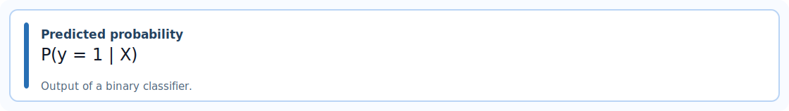

It is a linear model because it assumes the log-odds of the positive class are a linear combination of the features.

Use it as a baseline model because it is:

- Fast to train.
- Easy to interpret.
- Strong on simple or mostly linear problems.
- Useful when explainability matters, for example credit scoring or medical risk factors.

### Why We Need the Sigmoid Function

A linear model can output any value from `-infinity` to `+infinity`:

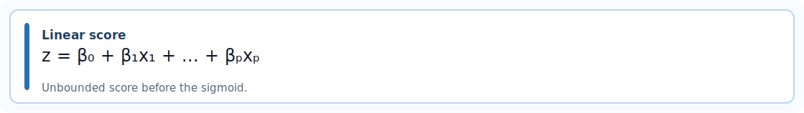

But a probability must stay between `0` and `1`.

So logistic regression transforms the linear score `z` using the sigmoid function:

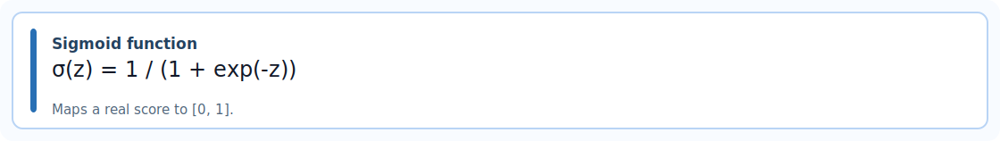

This gives:

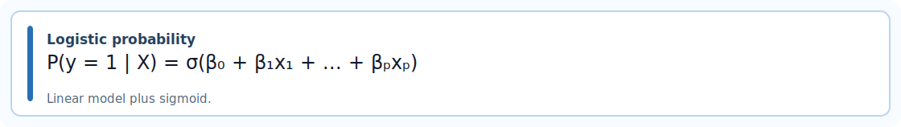

The sigmoid is appropriate because:

- Its output is always between `0` and `1`.
- It is smooth and differentiable, so gradient-based optimization works.
- It is the inverse of the logit, which comes from the log-odds assumption.

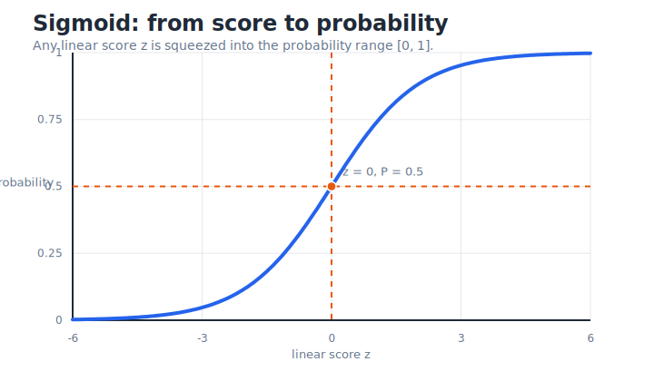

### Odds and Log-Odds

Probability:

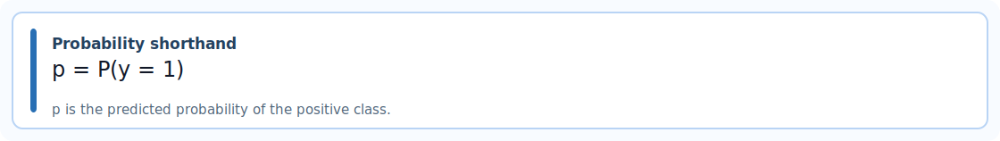

Odds:

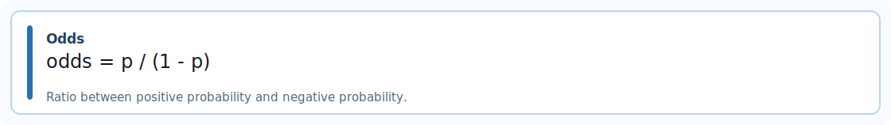

Log-odds, also called the logit:

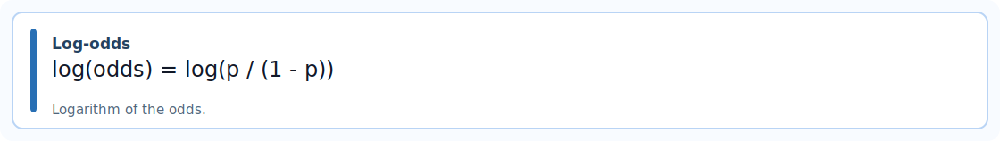

Logistic regression assumes:

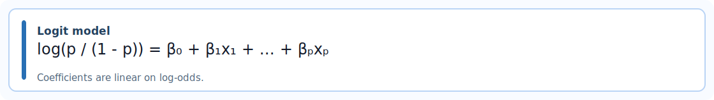

So logistic regression is linear regression on the log-odds, not directly on the probability.

### Decision Boundary

By default, logistic regression predicts class `1` when:

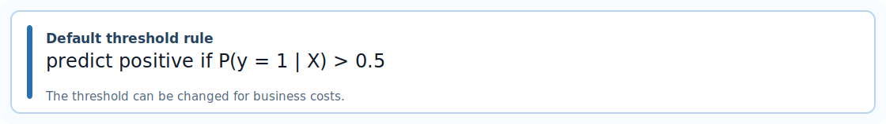

Since `sigmoid(0) = 0.5`, the decision boundary is where:

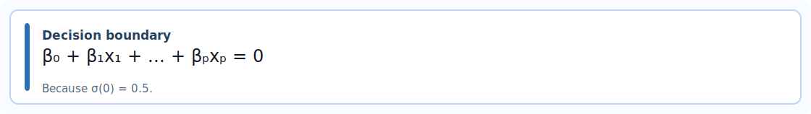

In 2D, this is a line. In higher dimensions, it is a hyperplane.

This explains the main limitation of logistic regression: it draws a linear boundary. If the real pattern is circular, checkerboard-like, or strongly non-linear, logistic regression needs feature engineering or should be replaced by a non-linear model.

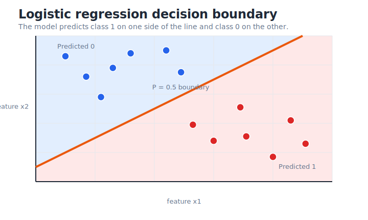

### Interpreting Coefficients

Each coefficient changes the log-odds.

If `x_j` increases by 1 unit:

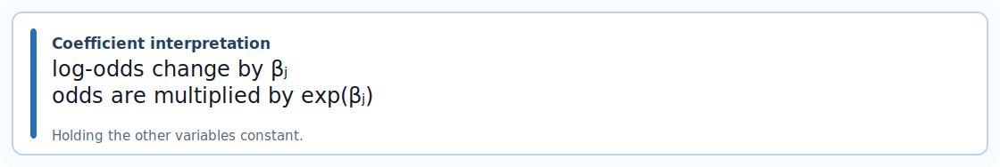

Interpretation:

- If `beta_j > 0`, the feature increases the odds of class `1`.
- If `beta_j < 0`, the feature decreases the odds of class `1`.
- If `exp(beta_j) = 2`, the odds are multiplied by 2.
- If `exp(beta_j) = 0.5`, the odds are divided by 2.

Example:

```text
beta_age = -0.04
exp(-0.04) = 0.96
```

For each additional year of age, the odds are multiplied by `0.96`, meaning they decrease by about 4%, all else equal.

Important exam phrase: "all else equal" matters because the coefficient is interpreted while holding the other variables constant.

### Loss Function: Why Not MSE?

For binary classification, the target follows a Bernoulli distribution:

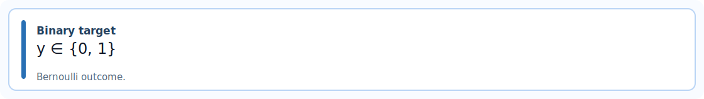

The correct loss is binary cross-entropy, also called log-loss:

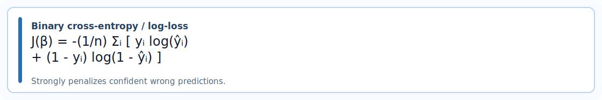

This comes from maximum likelihood estimation for a Bernoulli variable.

MSE is not the right loss for logistic regression because:

- MSE assumes Gaussian errors, not Bernoulli outcomes.
- MSE combined with sigmoid can create non-convex optimization.
- MSE can suffer from vanishing gradients when the model is confidently wrong.

With cross-entropy, a confidently wrong prediction is strongly penalized, so the model receives a large corrective gradient.

### Training

There is no simple closed-form solution like ordinary linear regression. Logistic regression is trained through iterative optimization.

Generic update rule:

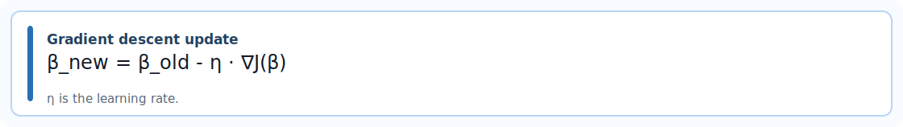

The gradient has the intuitive form:

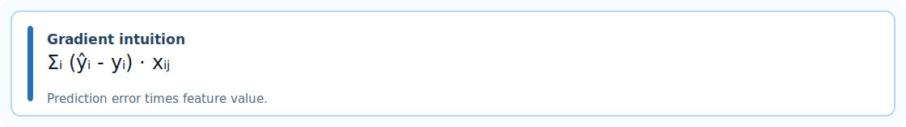

That means the model adjusts each coefficient according to:

- The prediction error.
- The value of the corresponding feature.

### Feature Scaling

Logistic regression should usually use standardized features:


Why:

- Gradient-based optimization is sensitive to feature scale.
- A feature like salary may range from 20,000 to 100,000, while age ranges from 18 to 80.
- Without scaling, optimization can be slow or unstable.

Scaling also makes coefficients more comparable when features are measured in different units.

### Multi-Class Logistic Regression

For more than two classes, there are two main strategies.

#### One-vs-Rest

Train one binary classifier per class:

```text
Class A vs not A
Class B vs not B
Class C vs not C
```

At prediction time, choose the class with the highest score.

Advantage: simple and works with any binary classifier.

#### Multinomial / Softmax

Softmax directly outputs a probability distribution over all classes:

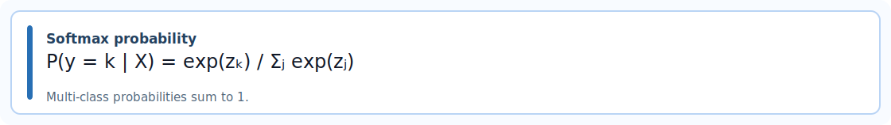

Properties:

- Every class probability is positive.
- All probabilities sum to 1.
- The loss is categorical cross-entropy.

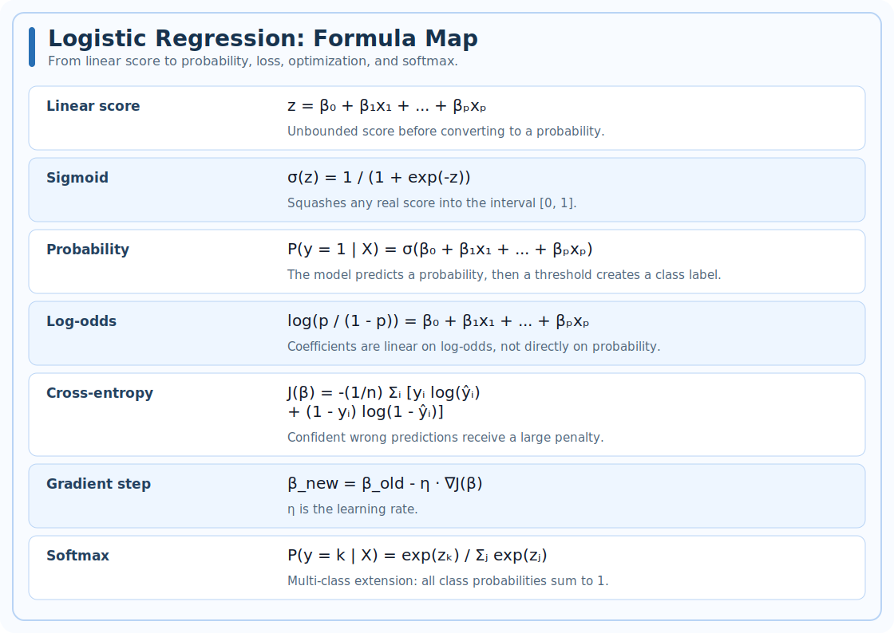

### When to Use Logistic Regression

Use logistic regression when:

- You need a strong, simple baseline.
- Interpretability is important.
- The relationship is approximately linear in the log-odds.
- The dataset is small or medium-sized.
- You need probabilities, not just class labels.
- You are in a regulated context where decisions must be explainable.

Avoid relying only on logistic regression when:

- The decision boundary is strongly non-linear.
- Feature interactions are complex and not manually engineered.
- Predictive performance matters much more than interpretability.

### Logistic Regression Exam Traps

- It is a classification model, not a regression model.
- It is linear in the log-odds, not linear in the probability.
- The default threshold `0.5` is not sacred; it can be tuned.
- Accuracy is not enough to evaluate it on imbalanced data.
- Coefficients affect odds multiplicatively through `exp(beta_j)`.
- Feature scaling is important for optimization.

---

## 3. Evaluation Metrics

### The Confusion Matrix

For binary classification:

| Reality / Prediction | Predicted Positive | Predicted Negative |
| --- | --- | --- |
| Actual Positive | True Positive (TP) | False Negative (FN) |
| Actual Negative | False Positive (FP) | True Negative (TN) |

Meaning:

- TP: predicted positive and it was positive.
- TN: predicted negative and it was negative.
- FP: predicted positive but it was negative. This is a false alarm.
- FN: predicted negative but it was positive. This is a missed detection.

Statistical terminology:

- Type I error = False Positive.
- Type II error = False Negative.


### Accuracy

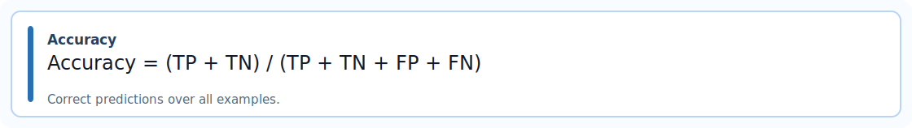

Accuracy answers:

```text
What proportion of all predictions were correct?
```

Accuracy is useful when classes are balanced and error costs are similar.

It is dangerous on imbalanced data. Example: if fraud is 0.1% of the dataset, a model that always predicts "not fraud" gets 99.9% accuracy while detecting zero fraud.

### Precision


Precision answers:

```text
When the model predicts positive, how often is it correct?
```

High precision means few false positives.

Use precision when false positives are expensive.

Examples:

- Spam filter: do not put important work emails in spam.
- Recommender system: do not recommend irrelevant items.
- Automatic ban system: avoid banning innocent users.

### Recall

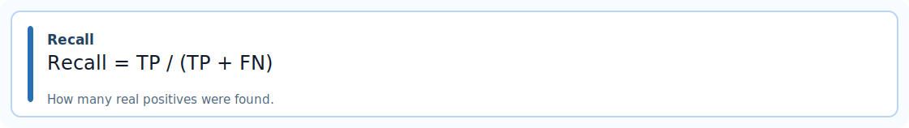

Recall is also called sensitivity or true positive rate.

Recall answers:

```text
Out of all real positives, how many did the model find?
```

High recall means few false negatives.

Use recall when missing a positive case is expensive.

Examples:

- Cancer screening.
- Fraud detection.
- Safety or security detection.

### Specificity


Specificity answers:

```text
Out of all real negatives, how many did the model correctly reject?
```

High specificity means the model avoids false alarms among negatives.

Relationship:

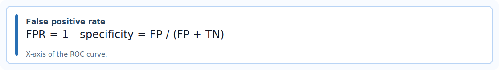

### Precision vs Recall vs Specificity

These metrics have different denominators:

| Metric | Formula | Denominator | Main question |
| --- | --- | --- | --- |
| Precision | `TP / (TP + FP)` | Predicted positives | Are positive predictions trustworthy? |
| Recall | `TP / (TP + FN)` | Actual positives | Did we find the real positives? |
| Specificity | `TN / (TN + FP)` | Actual negatives | Did we correctly reject negatives? |

Golden rules:

- Recall measures performance on actual positives.
- Specificity measures performance on actual negatives.
- Precision measures the quality of positive predictions.

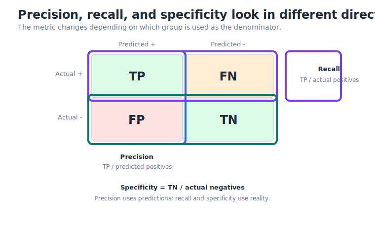

### Precision-Recall Trade-Off

Most classifiers produce a score or probability first, then apply a threshold.

For logistic regression:


If threshold increases:

- It becomes harder to predict positive.
- Precision usually increases.
- Recall usually decreases.

If threshold decreases:

- It becomes easier to predict positive.
- Recall usually increases.
- Precision usually decreases.

The threshold should be chosen according to the cost of mistakes, not automatically left at `0.5`.


### F1-Score

F1 combines precision and recall:

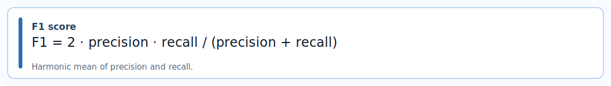

It is the harmonic mean of precision and recall.

Why harmonic mean?

- It punishes imbalance.
- If precision is high but recall is near zero, F1 is near zero.
- If recall is high but precision is near zero, F1 is near zero.

Use F1 when:

- You need one metric.
- Precision and recall are both important.
- Classes are imbalanced.

Do not use F1 blindly if the business cost of FP and FN is not balanced.

### F-Beta Score

F-beta generalizes F1:

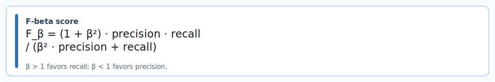

Interpretation:

- `beta = 1`: balance precision and recall.
- `beta < 1`: focus more on precision.
- `beta > 1`: focus more on recall.

Examples:

- `F_0.5`: useful when false positives are especially costly.
- `F_2`: useful when false negatives are especially costly.

Exam trap:

When `beta > 1`, F-beta emphasizes recall even though the denominator contains `beta^2 * Precision`. This happens because F-beta is a weighted harmonic mean. The weight is applied to the inverse of recall, and after algebraic rearrangement it appears next to precision.

### Cost-Based Thresholding

The best threshold is often the one that minimizes expected business cost:

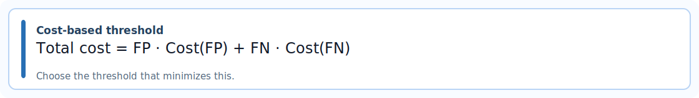

Example:

- Fraud missed: `Cost(FN) = 1000`
- Legit transaction blocked: `Cost(FP) = 10`

In that case, you usually prefer higher recall because false negatives are far more expensive.

### ROC Curve

ROC stands for Receiver Operating Characteristic.

It plots model performance across all thresholds:

- X-axis: False Positive Rate = `FP / (FP + TN)` = `1 - specificity`.
- Y-axis: True Positive Rate = recall = `TP / (TP + FN)`.

How to read it:

- Top-left is ideal: high recall, low false positive rate.
- Diagonal line is random guessing.
- The curve should rise quickly upward before moving right.

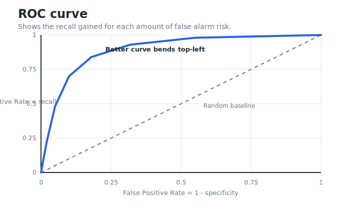

### AUC

AUC is the area under the ROC curve.

Interpretation:

- `AUC = 0.5`: random ranking.
- `AUC = 1.0`: perfect ranking.
- `AUC = 0.8` to `0.9`: often considered good.

Important interpretation:


AUC measures ranking quality, not calibration.

Calibration asks:

```text
If the model says 0.80 probability, does the event happen about 80% of the time?
```

Two models can have the same AUC even if one outputs useful probabilities and the other outputs compressed scores like `0.51` and `0.49`.

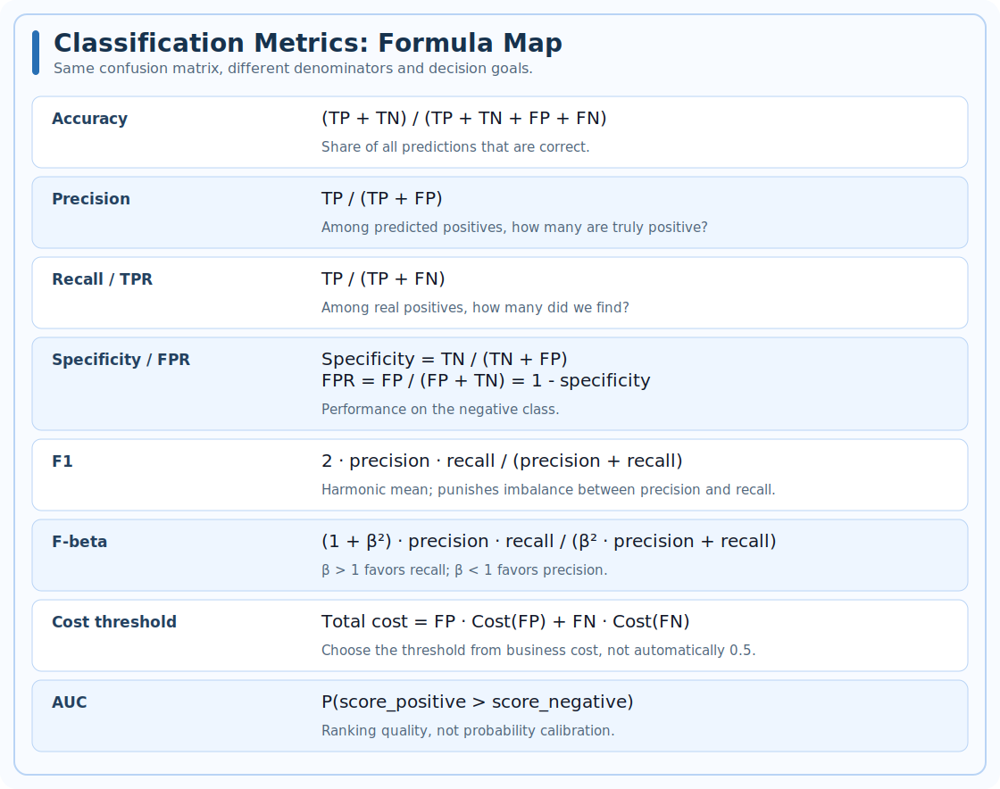

### Precision-Recall Curve

A precision-recall curve plots:

- X-axis: recall.
- Y-axis: precision.

The ideal point is top-right:

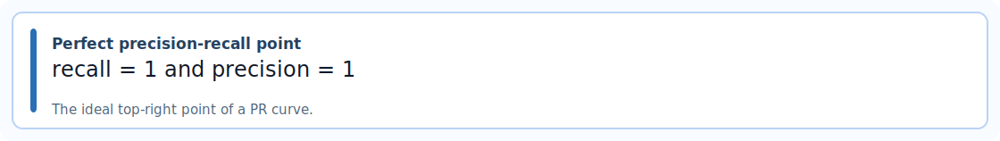

The random baseline is:

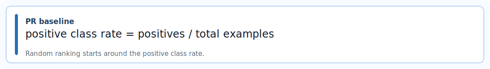

Use PR curves when:

- The positive class is rare.
- You care strongly about finding positives.
- Precision collapses quickly when you increase recall.

For fraud, cancer, anomaly detection, or rare-event detection, PR curves are often more informative than ROC curves.

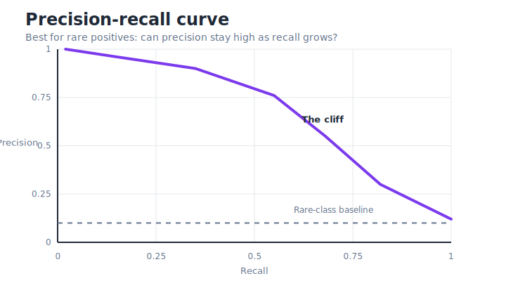

### ROC vs PR Curve

| Situation | Prefer |
| --- | --- |
| Balanced classes | ROC can be useful |
| True negatives matter a lot | ROC can be useful |
| Positive class is rare | PR curve is usually better |
| You care about precision and recall | PR curve |
| You care about ranking positives above negatives | AUC-ROC |

### Multi-Class Metrics

For multi-class classification, compute metrics one class at a time using One-vs-Rest, then average.

Macro average:

- Compute metric for each class.
- Take the simple average.
- Treats all classes equally.
- Useful when minority classes matter.

Weighted average:

- Compute metric for each class.
- Weight each class by its number of true examples.
- Can hide bad performance on rare classes.

Exam trap: on imbalanced multi-class data, weighted F1 can look good even if the model fails on the minority class. Macro F1 is stricter.

---

## 4. Decision Trees

### What They Are

A decision tree is a supervised learning algorithm for classification or regression.

It predicts by asking a sequence of questions:

```text
Is age <= 30?
Is income > 50000?
Is tumor size <= 2.5?
```

The structure:

- Root node: the first split, representing the full dataset.
- Internal node: a decision rule.
- Branch: the path from one node to another.
- Leaf node: the final prediction.

For classification, the leaf predicts a class.

For regression, the leaf predicts a numerical value, usually the mean target value of training observations in that leaf.

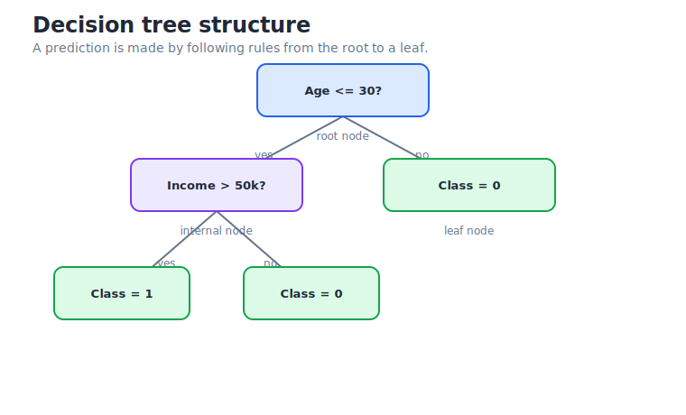

### How CART Builds a Classification Tree

CART stands for Classification and Regression Trees.

At each node, CART tries to find the best split.

For numerical features:

1. Sort the unique values.
2. Compute midpoints between consecutive values.
3. Try each midpoint as a threshold.
4. Split the data into left and right groups.
5. Compute the impurity of the split.
6. Choose the split with the lowest weighted impurity.

The process repeats recursively until a stopping condition is reached.

Important: CART is greedy.

That means it chooses the best split now, not necessarily the split that leads to the globally best tree later. This makes decision trees fast, but not globally optimal.

### Gini Impurity

Gini impurity measures how mixed a node is.

For a node `D` with `c` classes:

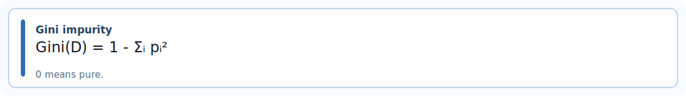

where `p_i` is the proportion of class `i` in the node.

Interpretation:

- `Gini = 0`: pure node, all observations have the same class.
- Higher Gini: more mixed node.
- In binary classification, maximum Gini is `0.5`, when classes are split 50/50.

Weighted Gini after a split:

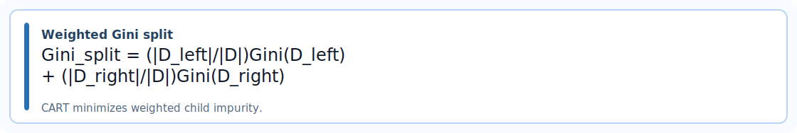

The best split is the one with the lowest `Gini_split`.

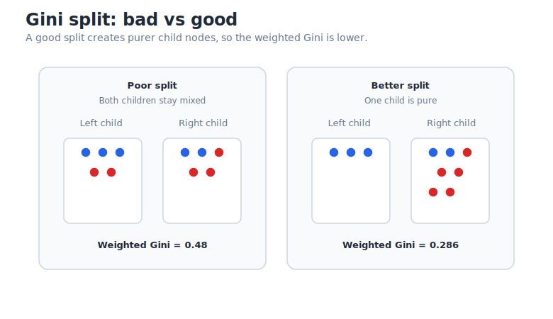

### Entropy and Information Gain

Entropy is another impurity measure:

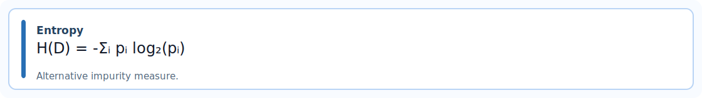

Information gain measures how much entropy decreases after a split:

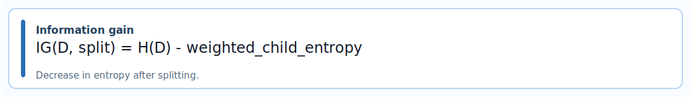

Comparison:

- Gini is faster because it does not use logarithms.
- Entropy can produce slightly more balanced trees.
- In practice, results are often similar.

### Regression Trees

Regression trees predict continuous values.

Instead of minimizing Gini impurity, they minimize mean squared error.

For a node `t`:

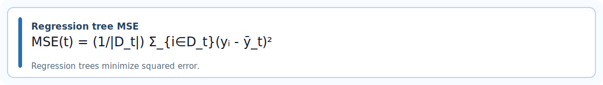

A split is good if it reduces the weighted MSE of the child nodes.

Prediction in a leaf:

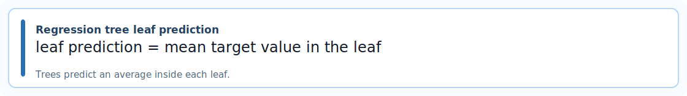

Important limitation: regression trees do not extrapolate well. If trained only on houses from 30m2 to 110m2, they cannot reliably predict prices for 150m2 because they only average values seen in leaves.

### Decision Boundaries

Decision trees create axis-aligned boundaries.

In 2D, they split like:

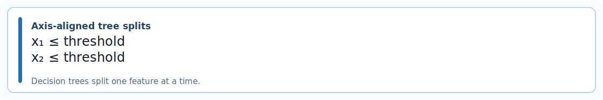

So their decision regions look rectangular or step-like.

Comparison:

- Logistic regression draws one straight diagonal line or hyperplane.
- Decision trees draw box-like regions.

To approximate a diagonal boundary, a tree may need many small splits, which can lead to overfitting.

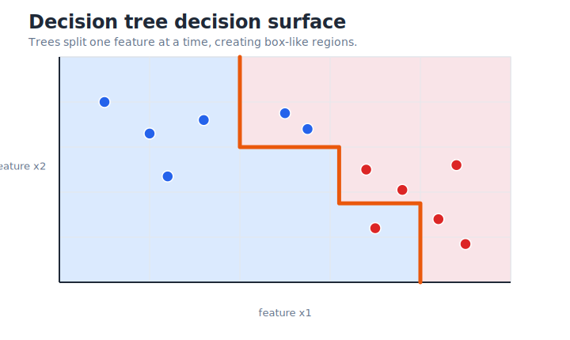

### Pruning and Regularization

Decision trees can easily overfit if allowed to grow too deep.

#### Pre-Pruning

Pre-pruning stops the tree early.

Common hyperparameters:

- `max_depth`: maximum depth of the tree.
- `min_samples_split`: minimum samples needed to split a node.
- `min_samples_leaf`: minimum samples required in a leaf.
- `max_leaf_nodes`: maximum number of leaves.

If the tree is stopped too early, it underfits. If it grows too much, it overfits.

#### Post-Pruning: Cost Complexity Pruning

Post-pruning grows a tree first, then removes branches that are not useful.

Cost complexity pruning uses:

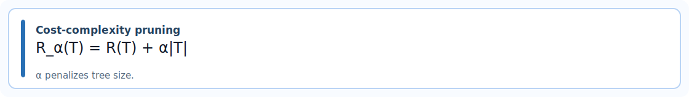

where:

- `R(T)` is the impurity or error of the tree.
- `|T|` is the number of leaf nodes.
- `alpha` controls how much we penalize complexity.

Higher `alpha` means stronger pruning and a smaller tree.

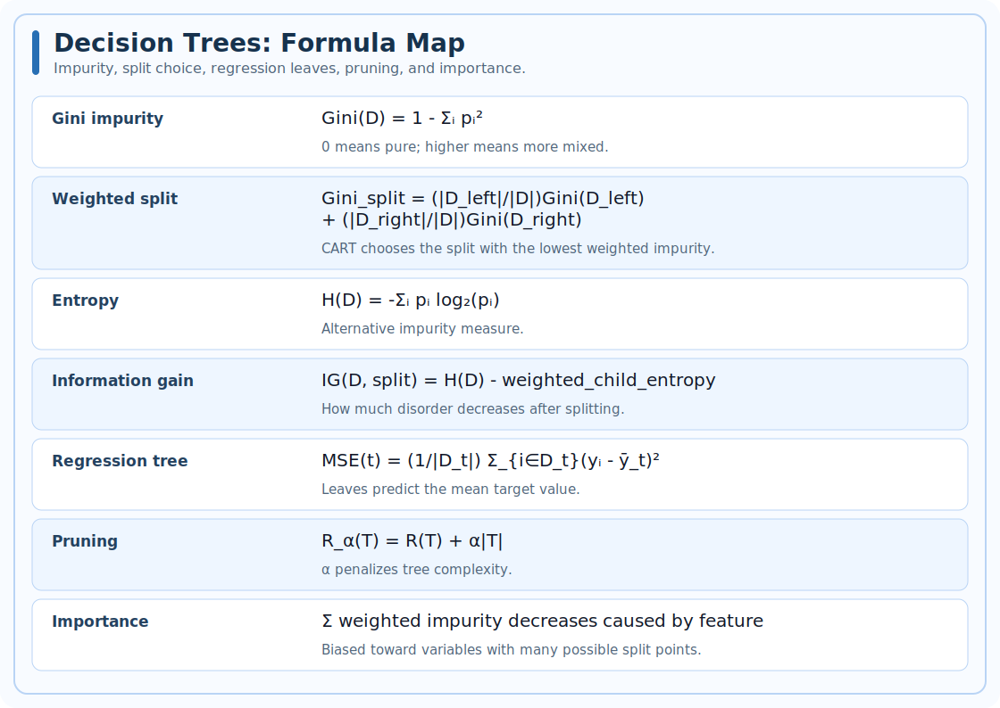

In scikit-learn:

```python
DecisionTreeClassifier(ccp_alpha=0.01)
```

### Feature Importance in Decision Trees

Decision trees can compute feature importance using impurity reduction.

A feature is important if:

- It is used often in splits.
- The splits where it is used strongly reduce impurity.
- The splits affect many observations.

General idea:


This is called Mean Decrease in Impurity, or MDI.

### When to Use Decision Trees

Use decision trees when:

- You want interpretable if/then rules.
- The relationship is non-linear.
- There are feature interactions.
- You want little preprocessing compared with linear models.
- You need a model that works for classification or regression.

Be careful when:

- The tree is very deep.
- The dataset is noisy.
- Small data changes produce a very different tree.
- You need smooth probability estimates.
- You need extrapolation in regression.

### Decision Tree Exam Traps

- A decision tree is greedy, not globally optimal.
- Gini impurity measures node impurity, not model accuracy.
- The best split is the one with lowest weighted child impurity.
- Trees can overfit badly without pruning or depth constraints.
- Tree boundaries are axis-aligned, not diagonal.
- Regression trees predict averages in leaves; they do not extrapolate naturally.

---

## 5. Random Forests

### What They Are

A random forest is an ensemble of decision trees.

Instead of relying on one tree, it trains many trees and combines their predictions.

For classification:

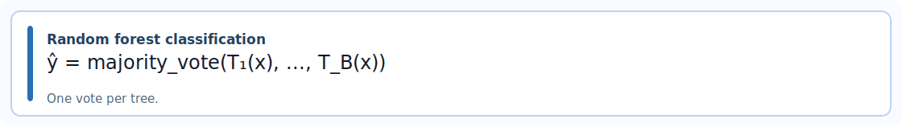

For regression:

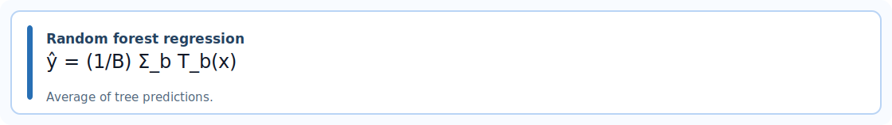

The purpose is to reduce the high variance of individual decision trees.

### Ensemble Intuition

A single decision tree can be unstable. Small changes in the training data can produce a very different tree.

A random forest reduces this instability by combining many trees.

The "wisdom of crowds" works when:

- Each tree is better than random guessing.
- The trees make different errors.
- The trees are not too correlated with each other.

If all trees are identical, voting does not help. Diversity is essential.

### Weak and Strong Learners

A weak learner is a model that performs only slightly better than random guessing.

A strong learner is a model that achieves high predictive performance.

The idea of ensemble methods is to combine many weak or unstable learners into a stronger learner. A random forest does this by combining many decision trees.

### Main Ensemble Families

Bagging:

- Trains models in parallel on different bootstrap samples.
- Reduces variance.
- Example: random forest.

Boosting:

- Trains models sequentially.
- Each new model focuses more on previous mistakes.
- Mainly reduces bias.
- Examples: AdaBoost, XGBoost, LightGBM.

Stacking:

- Trains several different base models.
- Then trains a final meta-model to combine their predictions.

Random forest belongs to the bagging family.

### Bagging: Bootstrap Aggregating

Bagging creates many different training sets from the original data.

For each tree:

1. Sample `n` rows from the training set of size `n`.
2. Sample with replacement, so the same row can appear multiple times.
3. Train one tree on that bootstrap sample.

Because sampling is done with replacement:

- About 63.2% of unique observations appear in a given bootstrap sample.
- About 36.8% are left out for that tree.

The left-out observations are called out-of-bag samples.

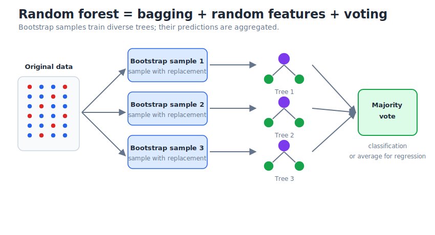

### Out-of-Bag Validation

For each observation, some trees did not see it during training.

OOB validation predicts that observation using only trees where it was out-of-bag.

This gives a natural validation estimate without needing a separate validation split.

In scikit-learn:

```python
RandomForestClassifier(oob_score=True)
```

OOB is useful, but it does not mean test sets are useless. A final test set is still important for unbiased final evaluation.

### Random Feature Selection

A random forest adds a second source of randomness: at each split, each tree only considers a random subset of features.

This is crucial.

Without random feature selection, if one feature is very strong, most trees will use it near the top. The trees become similar and their errors become correlated.

Random feature selection forces trees to explore different predictors. This decorrelates the trees and improves the forest.

Course rules of thumb:

- Classification: use about `sqrt(d)` features at each split.
- Regression: use about `d / 3` features at each split.

where `d` is the total number of features.

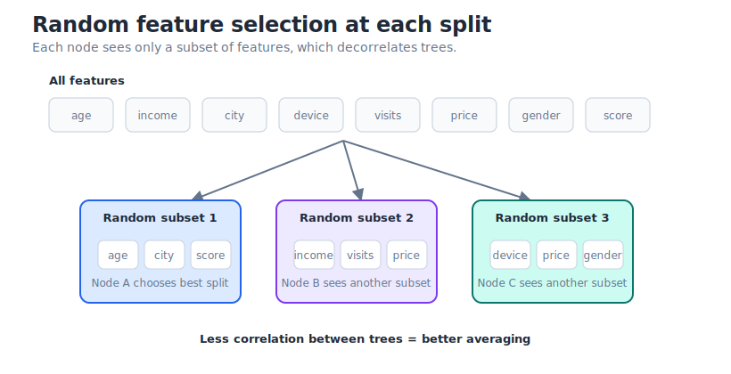

### Why Averaging Reduces Variance

If we average `B` independent models, each with variance `sigma^2`:

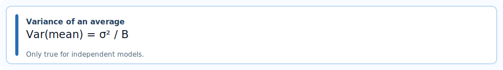

So more independent trees means lower variance.

But trees are not perfectly independent. If their correlation is `rho`, the forest variance is:


This formula explains random forests:

- Increasing `B` helps.
- But if `rho` is high, there is a limit to the improvement.
- Random feature selection lowers `rho`.


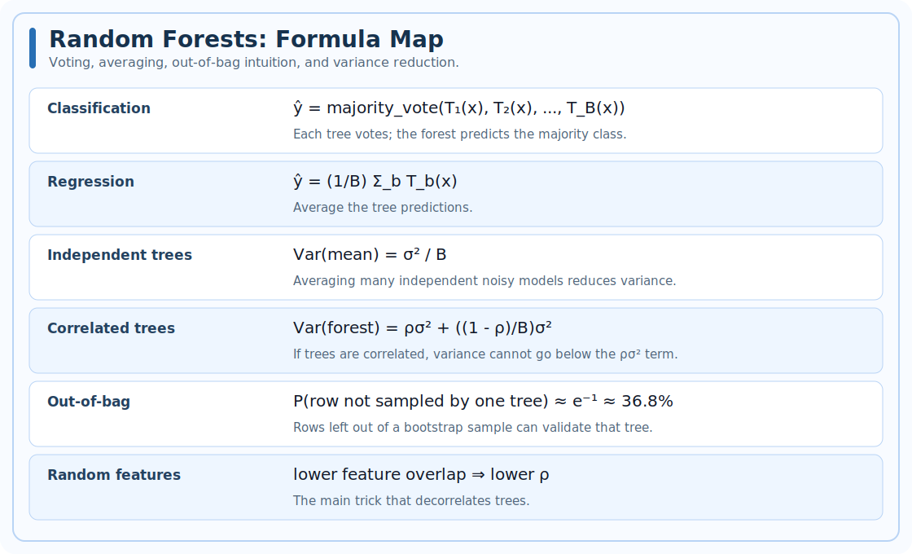

### Random Forest Algorithm

Training:

1. Choose number of trees `B`.
2. For each tree:
   - Draw a bootstrap sample from the training data.
   - Grow a decision tree.
   - At each node, randomly select `m` candidate features.
   - Choose the best split among those `m` features using Gini or MSE.
   - Continue until a stopping rule is reached.

Prediction:

- Classification: each tree votes, and the majority class wins.
- Regression: average the tree predictions.

### Important Hyperparameters

`n_estimators`:

- Number of trees.
- More trees usually reduce variance.
- More trees also increase training time and memory.
- Performance eventually stabilizes.

`max_features`:

- Number of features considered at each split.
- Smaller values increase tree diversity but can increase bias.
- Larger values make trees stronger individually but more correlated.

`max_depth`:

- Maximum tree depth.
- Controls complexity of individual trees.

`min_samples_leaf`:

- Minimum samples per leaf.
- Larger values smooth the model and reduce overfitting.

`oob_score`:

- Enables out-of-bag validation.

`n_jobs`:

- Allows parallel training.
- `n_jobs=-1` uses all available CPU cores.

### Feature Importance in Random Forests

Random forests often report MDI feature importance.

For each tree, importance is the weighted impurity decrease caused by each feature. The forest averages that importance across all trees.

Interpretation:

- High importance means the feature often creates useful splits.
- Low importance means the feature contributes little to impurity reduction.

Pitfall:

MDI is biased toward features with many possible split points, such as continuous variables or high-cardinality categorical variables.

Alternative:

Use permutation importance to check whether a feature really matters. Permutation importance randomly shuffles a feature and measures how much model performance drops.

### When to Use Random Forests

Use random forests when:

- You have structured/tabular data.
- You expect non-linear relationships.
- You expect feature interactions.
- You have many weak predictors.
- The data is noisy.
- You want a strong model with limited tuning.
- You are prototyping and want feature importance.

Be careful when:

- You need full interpretability.
- The dataset is very large.
- Prediction latency or memory matters.
- A simple model is already good enough.
- You need a transparent model for regulation.

In production, businesses may prefer logistic regression for interpretability, or gradient boosted trees such as XGBoost/LightGBM for efficiency and performance on large datasets.

### Random Forest Exam Traps

- Random forest reduces variance, not mainly bias.
- Bagging uses bootstrap samples.
- Each tree sees about 63.2% unique samples and leaves about 36.8% out-of-bag.
- Random feature selection reduces correlation between trees.
- More trees help until performance stabilizes, but they do not fix high tree correlation.
- Feature importance from MDI can be biased toward high-cardinality features.

---

## 6. Model Selection Cheat Sheet

| Situation | Good choice | Why |
| --- | --- | --- |
| Need a simple baseline | Logistic regression | Fast, interpretable, strong baseline |
| Need explainability | Logistic regression or shallow tree | Easy to explain decisions |
| Linear decision boundary is enough | Logistic regression | Efficient and stable |
| Non-linear rules matter | Decision tree | Captures thresholds and interactions |
| Need high performance on tabular data | Random forest | Handles non-linearity and reduces variance |
| Dataset is noisy | Random forest | Averaging stabilizes predictions |
| Dataset is highly imbalanced | Any model + adapted metrics | Metric and threshold matter more than model alone |
| False positives are costly | Optimize precision or F-beta with beta < 1 | Avoid false alarms |
| False negatives are costly | Optimize recall or F-beta with beta > 1 | Avoid missed detections |
| Need rare-event evaluation | PR curve / Average Precision | More informative than ROC when positives are rare |

Course comparison note:

- Logistic regression is the most interpretable and cheapest to train.
- KNN can handle non-linearity but is expensive at inference because it compares new points with stored training data.
- Random forest is less interpretable than logistic regression but usually stronger on non-linear tabular problems.
- Tree-based methods can be more tolerant of messy feature behavior, but in practice you should still check how your implementation handles missing values and categorical variables.

---

## 7. How to Answer Common Exam Questions

### If Asked: "Why Is Accuracy Misleading?"

Answer structure:

1. Accuracy counts all correct predictions.
2. In imbalanced data, the majority class dominates.
3. A model can get high accuracy by always predicting the majority class.
4. Use confusion matrix, precision, recall, F1, PR curve, and business-cost analysis instead.

Example:

```text
Fraud rate = 0.1%.
Always predicting "not fraud" gives 99.9% accuracy but 0% recall for fraud.
```

### If Asked: "How Does Logistic Regression Work?"

Answer structure:

1. It computes a linear score `z = beta_0 + beta^T X`.
2. It transforms the score into a probability with sigmoid.
3. It predicts class `1` if the probability is above a threshold.
4. It learns coefficients by minimizing binary cross-entropy.
5. Coefficients are interpreted through odds ratios.

### If Asked: "How Do You Interpret a Logistic Coefficient?"

Answer:

```text
A one-unit increase in x_j changes the log-odds by beta_j.
The odds are multiplied by exp(beta_j), holding other variables constant.
```

If `beta_j` is negative, the odds decrease.

### If Asked: "How Does CART Choose a Split?"

Answer structure:

1. For each feature, generate possible thresholds.
2. Split the data at each threshold.
3. Compute weighted impurity of child nodes.
4. Choose the split with lowest weighted impurity.
5. Repeat recursively.

For classification, impurity is often Gini.

For regression, impurity is often MSE.

### If Asked: "Why Do Decision Trees Overfit?"

Answer:

Decision trees recursively split the data. If allowed to grow too deep, they can create leaves that fit small random patterns or noise in the training set. This gives low training error but poor generalization.

Solutions:

- Limit `max_depth`.
- Increase `min_samples_leaf`.
- Increase `min_samples_split`.
- Use cost complexity pruning with `ccp_alpha`.
- Use ensembles such as random forests.

### If Asked: "How Does Random Forest Improve a Decision Tree?"

Answer:

Random forest trains many decision trees on different bootstrap samples and makes them more diverse by considering only a random subset of features at each split. It aggregates their predictions by majority vote or averaging. This reduces variance and makes predictions more stable than a single tree.

### If Asked: "Why Are Random Features Important in Random Forest?"

Answer:

If every tree can always choose from all features, strong predictors may dominate early splits, making trees similar. Similar trees make similar errors, so averaging helps less. Random feature selection decorrelates the trees, improving variance reduction.

### If Asked: "ROC or PR Curve?"

Use ROC when:

- Classes are relatively balanced.
- False positive rate and true negative behavior matter.
- You want a ranking measure like AUC.

Use PR when:

- The positive class is rare.
- You care about precision and recall.
- False positives among predicted positives are important.

---

## 8. Final Mental Map

Logistic regression:

- Linear in log-odds.
- Outputs probabilities.
- Trained with cross-entropy.
- Interpretable through odds ratios.
- Good baseline, weak for complex non-linear boundaries.

Metrics:

- Accuracy can fail on imbalance.
- Precision controls false positives.
- Recall controls false negatives.
- F1 balances precision and recall.
- F-beta weights precision vs recall.
- ROC/AUC measures ranking across thresholds.
- PR curves are better for rare positives.

Decision trees:

- Recursive if/then splits.
- CART chooses splits greedily.
- Classification uses Gini or entropy.
- Regression uses MSE.
- Easy to interpret but unstable and prone to overfitting.

Random forests:

- Many decision trees.
- Bootstrap samples create different training sets.
- Random feature subsets decorrelate trees.
- Aggregation reduces variance.
- Strong on tabular non-linear data, less interpretable than a single tree.
