# Guide de révision - Apprentissage non supervisé

Ce guide couvre trois grands blocs :

1. Le clustering
2. La réduction de dimensionnalité
3. La détection d'anomalies

L'objectif est de comprendre les modèles en profondeur sans se perdre dans du texte inutile : comment ils fonctionnent, ce qu'ils optimisent, dans quels cas les utiliser, et quels pièges éviter à l'examen.

---

## 1. Vue d'ensemble : apprentissage non supervisé

En apprentissage supervisé, on dispose d'une cible `y`. Le modèle apprend à prédire cette cible.

En apprentissage non supervisé, il n'y a pas de cible :

```text
On observe seulement X.
```

Le but est donc de découvrir une structure cachée dans les données :

- Des groupes naturels de points.
- Des dimensions plus simples qui résument l'information.
- Des observations inhabituelles ou anormales.

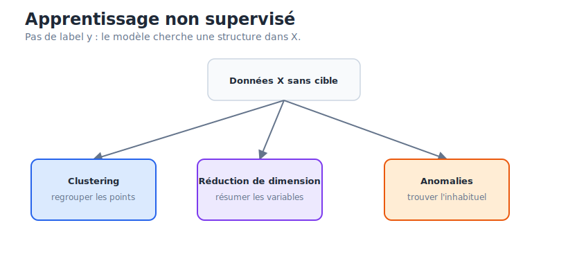

Les trois grandes familles du cours :

| Famille | Question centrale | Exemples |
| --- | --- | --- |
| Clustering | Quels points se ressemblent ? | K-Means, GMM, hiérarchique, DBSCAN |
| Réduction de dimension | Comment résumer beaucoup de variables ? | PCA, t-SNE, UMAP |
| Détection d'anomalies | Quels points ne ressemblent pas au reste ? | One-Class SVM, Isolation Forest, LOF |

La difficulté principale : il n'existe souvent pas de "bonne réponse" évidente. L'évaluation est donc plus indirecte que dans le supervisé.

---

## 2. Clustering

Le clustering consiste à regrouper des observations similaires.

Exemples :

- Segmenter des clients.
- Grouper des produits selon leur comportement d'achat.
- Trouver des zones géographiques homogènes.
- Identifier des groupes de comportements dans des logs.

### Hard vs soft clustering

Hard clustering :

- Chaque point appartient à un seul cluster.
- L'affectation est stricte.
- Exemple : K-Means.

```text
P(C_k | x_i) ∈ {0, 1}
```

Soft clustering :

- Chaque point a une probabilité d'appartenir à chaque cluster.
- L'affectation est probabiliste.
- Exemple : Gaussian Mixture Model.

```text
P(C_k | x_i) ∈ [0, 1]
```

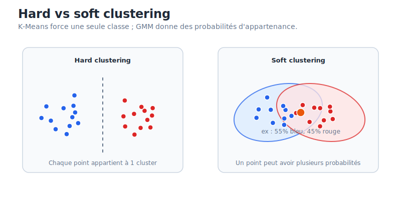

### Familles de clustering

| Famille | Idée | Modèles | Type d'affectation |
| --- | --- | --- | --- |
| Centroid-based | Chaque cluster est représenté par un centre | K-Means | Hard |
| Distribution-based | Les données viennent d'un mélange de distributions | GMM | Soft |
| Hierarchical | On construit un arbre de fusions ou divisions | Agglomerative clustering | Hard |
| Density-based | Les clusters sont des zones de forte densité | DBSCAN, HDBSCAN | Hard + bruit |

---

## 3. K-Means

### Ce que c'est

K-Means est un algorithme de clustering basé sur des centroïdes.

Il cherche `K` clusters. Chaque cluster est représenté par son centre, appelé centroïde.

Un point est affecté au cluster dont le centroïde est le plus proche.

### Comment l'algorithme fonctionne

1. Choisir `K`, le nombre de clusters.
2. Initialiser `K` centroïdes.
3. Affecter chaque point au centroïde le plus proche.
4. Recalculer chaque centroïde comme la moyenne des points de son cluster.
5. Répéter les étapes 3 et 4 jusqu'à stabilisation.

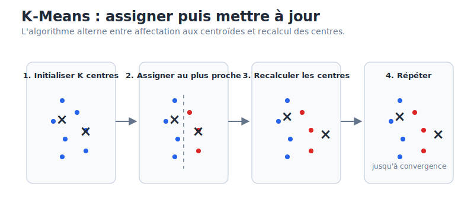

### Ce que K-Means optimise

K-Means minimise l'inertie, aussi appelée WCSS :

```text
WCSS = somme des distances au carré entre chaque point et son centroïde
```

Formellement :

```text
min Σ_k Σ_{x_i dans C_k} ||x_i - μ_k||²
```

où :

- `C_k` est le cluster `k`.
- `μ_k` est le centroïde du cluster `k`.

K-Means veut donc des clusters compacts autour de leur centre.

### Distance utilisée

K-Means utilise généralement la distance euclidienne :

```text
d(x, c) = sqrt(Σ_j (x_j - c_j)^2)
```

Conséquence directe : les variables doivent être mises à l'échelle.

Si une variable est mesurée en milliers d'euros et une autre entre `0` et `1`, la première dominera les distances. Il faut donc utiliser une standardisation :

```text
x_scaled = (x - mean) / standard_deviation
```

### Choisir K : elbow method

K-Means ne choisit pas `K` tout seul.

On teste plusieurs valeurs de `K`, puis on trace l'inertie.

Quand `K` augmente :

- L'inertie diminue toujours.
- Mais à partir d'un certain point, ajouter un cluster n'apporte presque plus rien.

Ce point est le "coude".

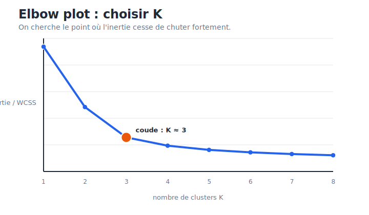

Piège important : le coude n'est pas toujours clair. Si la courbe descend progressivement sans rupture nette, il faut compléter avec d'autres critères : interprétabilité métier, silhouette score, stabilité des clusters.

### Silhouette score

Le silhouette score mesure à la fois :

- La cohésion : le point est-il proche des points de son cluster ?
- La séparation : le point est-il loin des autres clusters ?

Il varie entre `-1` et `1` :

- Proche de `1` : bon clustering.
- Proche de `0` : point entre deux clusters.
- Négatif : point probablement mal assigné.

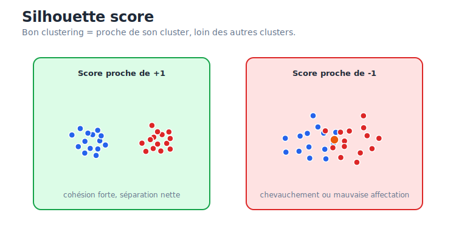

### Hyperparamètres importants

`n_clusters` :

- Nombre de clusters `K`.
- Doit être choisi avant l'entraînement.

`n_init` :

- Nombre de lancements de l'algorithme avec des initialisations différentes.
- Important car K-Means peut tomber sur une mauvaise solution selon les centres initiaux.

`max_iter` :

- Nombre maximum d'itérations pour une exécution.

`random_state` :

- Fixe l'aléatoire pour obtenir des résultats reproductibles.

### Biais et limites

K-Means marche bien si les clusters sont :

- Sphériques.
- Convexes.
- De taille comparable.
- Séparables par distance euclidienne.

Il marche mal si :

- Les clusters ont des formes complexes.
- Les clusters ont des densités très différentes.
- Il y a beaucoup d'outliers.
- Les variables ne sont pas scaled.
- La dimension est très élevée.

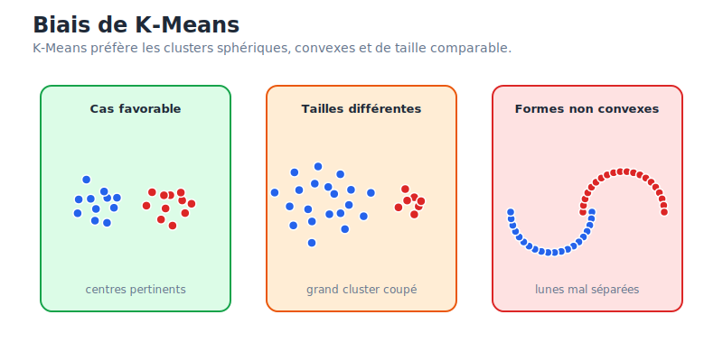

### Quand utiliser K-Means

Utiliser K-Means lorsque :

- Le dataset est grand.
- On veut un modèle simple et rapide.
- Les clusters attendus sont plutôt compacts.
- On accepte de choisir `K`.
- On veut une première segmentation exploratoire.

Éviter K-Means lorsque :

- Les clusters sont en forme de lunes, anneaux, bandes ou formes non convexes.
- Il y a beaucoup de bruit ou d'anomalies.
- Les clusters ont des tailles très différentes.
- L'interprétation probabiliste est importante.

### Pièges d'examen sur K-Means

- K-Means ne choisit pas `K`.
- L'inertie diminue toujours quand `K` augmente.
- Il faut scaler les variables.
- K-Means optimise la compacité, pas forcément le "vrai" clustering métier.
- Les centroïdes sont des moyennes, donc sensibles aux outliers.
- Les résultats dépendent de l'initialisation.

---

## 4. Gaussian Mixture Models

### Ce que c'est

Un Gaussian Mixture Model, ou GMM, est un modèle de clustering probabiliste.

Il suppose que les données ont été générées par un mélange de distributions gaussiennes.

Au lieu de dire :

```text
ce point appartient au cluster A
```

il dit :

```text
ce point a 70% de probabilité d'appartenir au cluster A
et 30% au cluster B
```

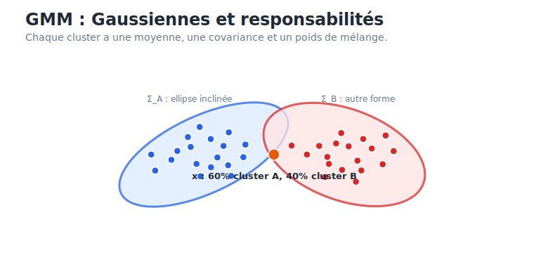

### Paramètres d'un cluster gaussien

Chaque composante gaussienne a :

`μ_k` :

- La moyenne.
- Le centre du cluster.

`Σ_k` :

- La matrice de covariance.
- Elle contrôle la forme, l'étalement et l'orientation du cluster.

`π_k` :

- Le poids de mélange.
- Il représente la proportion attendue de points dans ce cluster.

### Pourquoi GMM est plus flexible que K-Means

K-Means représente chaque cluster par un centre et utilise la distance euclidienne.

GMM représente chaque cluster par une distribution complète :

- Centre.
- Taille.
- Orientation.
- Forme.
- Probabilité d'appartenance.

Cela permet de modéliser des clusters elliptiques, allongés ou de tailles différentes.

### Algorithme EM

GMM est entraîné avec l'algorithme Expectation-Maximization.

E-step :

- Calculer les responsabilités.
- Pour chaque point, estimer la probabilité d'appartenance à chaque cluster.

M-step :

- Mettre à jour les paramètres `μ`, `Σ` et `π`.
- Choisir les paramètres qui maximisent la vraisemblance des données.

L'algorithme alterne E-step et M-step jusqu'à convergence.

### Distance de Mahalanobis

GMM prend en compte la covariance de chaque cluster.

La distance pertinente n'est donc pas seulement la distance euclidienne. On utilise l'idée de distance de Mahalanobis :

```text
distance ajustée par la forme et l'orientation du cluster
```

Intuition :

- Être loin dans une direction où le cluster est très étiré peut être normal.
- Être à la même distance dans une direction où le cluster est très serré peut être anormal.

### covariance_type

`covariance_type` contrôle les formes autorisées :

| Type | Géométrie | Commentaire |
| --- | --- | --- |
| `spherical` | Cercles / sphères | Simple, proche de K-Means mais probabiliste |
| `diag` | Ellipses alignées avec les axes | Pas de rotation |
| `tied` | Même covariance pour tous les clusters | Formes partagées |
| `full` | Covariance libre | Plus flexible, plus risqué |

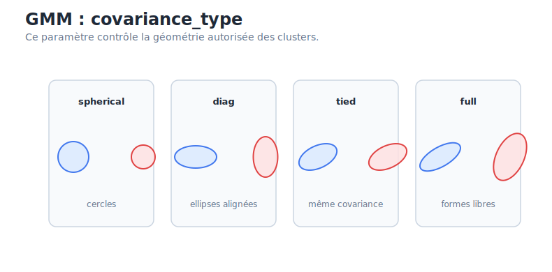

### Quand utiliser GMM

Utiliser GMM lorsque :

- Les clusters sont elliptiques.
- On veut des probabilités d'appartenance.
- Les clusters peuvent avoir des tailles ou orientations différentes.
- On veut une alternative plus flexible à K-Means.

Être prudent lorsque :

- Le dataset est très grand.
- La dimension est élevée.
- Il y a peu de données par cluster.
- Les données ne ressemblent pas du tout à un mélange de gaussiennes.

### Pièges d'examen sur GMM

- GMM fait du soft clustering.
- GMM suppose un mélange de distributions, pas seulement des centres.
- `full covariance` est flexible mais peut overfitter.
- GMM a souvent besoin de scaling.
- GMM reste sensible à l'initialisation.
- GMM a besoin de choisir `K`, comme K-Means.

---

## 5. Clustering hiérarchique

### Ce que c'est

Le clustering hiérarchique construit une hiérarchie de clusters.

La version la plus courante est agglomérative :

```text
bottom-up
```

Elle commence avec un cluster par point, puis fusionne progressivement les clusters les plus proches.

### Algorithme agglomératif

1. Chaque observation commence comme son propre cluster.
2. Calculer les distances entre clusters.
3. Fusionner les deux clusters les plus proches.
4. Recalculer les distances.
5. Répéter jusqu'à obtenir un seul grand cluster.

Ce processus crée un dendrogramme.

### Dendrogramme

Un dendrogramme est un arbre qui montre l'ordre des fusions.

L'axe vertical représente la distance à laquelle les clusters ont été fusionnés.

Pour choisir `K` :

1. Tracer une ligne horizontale.
2. Compter le nombre de branches verticales coupées.
3. Ce nombre est le nombre de clusters.

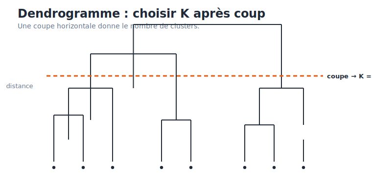

La bonne coupe se fait souvent dans une grande zone verticale sans fusion. Cela signifie que les clusters fusionnés au-dessus de cette hauteur étaient très différents.

### Linkage criteria

Le linkage définit la distance entre deux clusters.

Single linkage :

- Distance minimale entre deux points de clusters différents.
- Peut capturer des formes allongées.
- Risque fort : effet de chaînage.

Complete linkage :

- Distance maximale entre deux points de clusters différents.
- Produit des clusters compacts.
- Sensible aux outliers.

Average linkage :

- Distance moyenne entre tous les couples de points.
- Compromis plus stable.

Ward linkage :

- Fusionne les clusters qui augmentent le moins la variance intra-cluster.
- Très proche de l'idée de minimisation de l'inertie.
- Souvent un bon choix pratique.

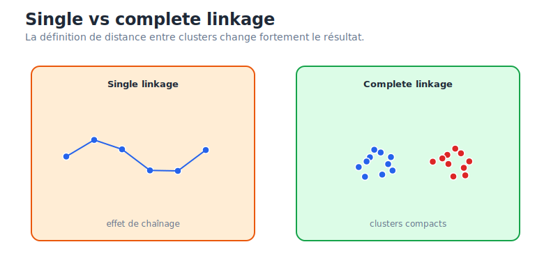

### Quand utiliser le clustering hiérarchique

Utiliser le clustering hiérarchique lorsque :

- Le dataset est petit ou moyen.
- On veut comprendre la structure imbriquée des données.
- On ne veut pas choisir `K` avant l'entraînement.
- On veut un dendrogramme interprétable.

Éviter lorsque :

- Le dataset est très grand.
- On a besoin d'un modèle très scalable.
- Les outliers sont nombreux.

### Pièges d'examen sur le clustering hiérarchique

- Il ne choisit pas automatiquement le meilleur `K`; le dendrogramme aide à choisir.
- L'algorithme est glouton : une fusion ne peut pas être annulée.
- Le choix du linkage change fortement les résultats.
- Single linkage peut créer un effet de chaînage.
- Complete linkage est sensible aux outliers.

---

## 6. DBSCAN et HDBSCAN

### Ce que c'est

DBSCAN signifie Density-Based Spatial Clustering of Applications with Noise.

Contrairement à K-Means, DBSCAN ne cherche pas des centres.

Il cherche des régions de forte densité séparées par des zones vides.

Avantages :

- Pas besoin de choisir `K`.
- Détecte naturellement le bruit.
- Peut trouver des formes non linéaires.

### Core, border, noise

DBSCAN classe les points en trois types.

Core point :

- Point avec au moins `MinPts` voisins dans un rayon `eps`.
- Il peut étendre un cluster.

Border point :

- Point qui n'a pas assez de voisins pour être core.
- Mais il est dans le voisinage d'un core point.
- Il appartient au cluster mais ne l'étend pas.

Noise point :

- Point qui n'est ni core ni border.
- Il est considéré comme outlier.

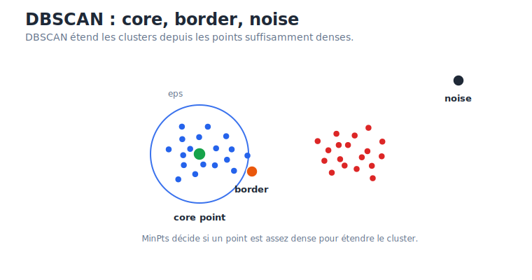

### Hyperparamètres

`eps` :

- Rayon de voisinage.
- Plus `eps` est grand, plus les clusters fusionnent facilement.
- Plus `eps` est petit, plus il y aura de bruit.

`min_samples` :

- Nombre minimum de points pour former une zone dense.
- Règle pratique : au moins `dimension + 1`, souvent 4 ou 5 en 2D.

### Choisir eps : K-distance graph

Pour choisir `eps`, on peut tracer la distance au k-ième plus proche voisin pour chaque point, triée par ordre croissant.

Le coude de cette courbe donne souvent une bonne valeur de `eps`.

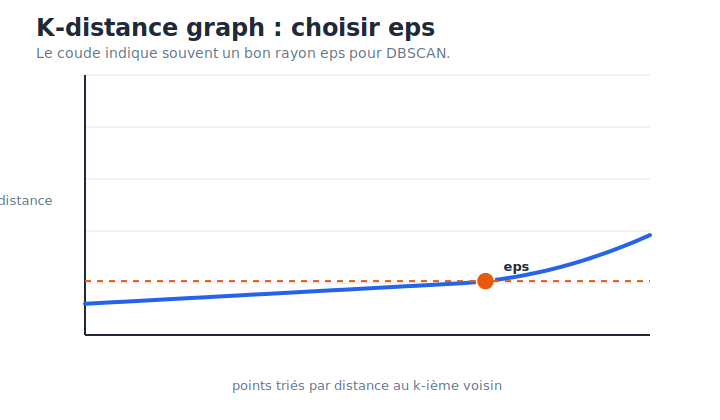

### Limites de DBSCAN

DBSCAN marche mal lorsque :

- Les clusters ont des densités très différentes.
- La dimension est très élevée.
- Le choix de `eps` est ambigu.
- Les données ne sont pas scaled.

Pourquoi les densités variables posent problème ?

DBSCAN utilise un seul `eps` global. Si un cluster est très dense et un autre très dispersé, le même rayon ne peut pas bien capturer les deux.

### HDBSCAN

HDBSCAN est une extension plus robuste.

Idée :

- Au lieu de choisir un seul `eps`, HDBSCAN explore plusieurs niveaux de densité.
- Il garde les clusters les plus stables.

HDBSCAN est souvent meilleur que DBSCAN lorsque les densités varient.

### Quand utiliser DBSCAN

Utiliser DBSCAN lorsque :

- Les clusters ont des formes complexes.
- Le bruit et les outliers comptent.
- On ne connaît pas `K`.
- Les densités sont relativement homogènes.

Éviter lorsque :

- Les densités varient fortement.
- Les données sont très haute dimension.
- Le dataset est très difficile à scaler proprement.

### Pièges d'examen sur DBSCAN

- DBSCAN ne demande pas `K`.
- DBSCAN dépend fortement de `eps`.
- DBSCAN peut marquer des points comme bruit.
- Un point border appartient à un cluster mais ne l'étend pas.
- DBSCAN est basé sur la densité, pas sur un centroïde.
- HDBSCAN aide lorsque les densités varient.

---

## 7. Métriques de clustering

### Pourquoi c'est difficile

En clustering, il n'y a généralement pas de label vrai.

On ne peut donc pas simplement calculer :

```text
accuracy = bonnes prédictions / total
```

Il faut utiliser des métriques internes ou une validation métier.

### Inertie

L'inertie mesure la compacité des clusters.

Elle est surtout utilisée avec K-Means.

```text
Inertie = somme des distances au carré aux centroïdes
```

Limite :

- Elle diminue toujours quand `K` augmente.
- Elle ne suffit donc pas seule à choisir `K`.

### Silhouette score

Le silhouette score compare :

- La distance moyenne au cluster du point.
- La distance moyenne au cluster voisin le plus proche.

Intuition :

```text
bon point = proche de son cluster et loin des autres
```

Avantage :

- Permet de comparer plusieurs valeurs de `K`.

Limite :

- Favorise souvent des clusters convexes et bien séparés.
- Peut mal juger DBSCAN sur des formes complexes.

### Validation métier

Un clustering est utile si les groupes sont actionnables.

Exemple :

- Segmenter des clients en 5 groupes n'a de valeur que si les équipes marketing peuvent réellement adapter une action à chaque groupe.

Question à toujours poser :

```text
Est-ce que les clusters sont stables, interprétables et utiles ?
```

---

## 8. Réduction de dimensionnalité

La réduction de dimensionnalité cherche à représenter les données avec moins de variables.

Objectifs possibles :

- Visualiser des données complexes.
- Réduire le bruit.
- Accélérer les modèles.
- Éviter la multicolinéarité.
- Préparer un clustering.
- Construire des KPIs composites.

### Fléau de la dimensionnalité

Quand le nombre de dimensions augmente :

- L'espace devient immense.
- Les points deviennent plus isolés.
- Les distances deviennent moins informatives.
- Les modèles peuvent overfitter.
- Les calculs coûtent plus cher.

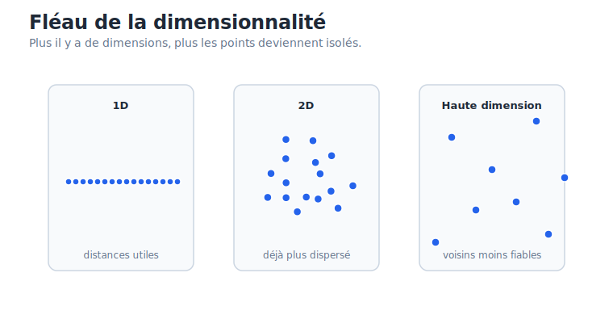

Conséquence : les méthodes basées sur la distance, comme K-Means, DBSCAN, KNN ou LOF, deviennent moins fiables en haute dimension.

---

## 9. PCA

### Ce que c'est

PCA signifie Principal Component Analysis.

C'est une méthode linéaire de réduction de dimensionnalité.

Elle transforme des variables corrélées en nouvelles variables non corrélées :

```text
principal components
```

Ces composantes sont ordonnées par variance expliquée.

PC1 :

- Direction qui capture le plus de variance.

PC2 :

- Direction orthogonale à PC1.
- Capture la deuxième plus grande variance possible.

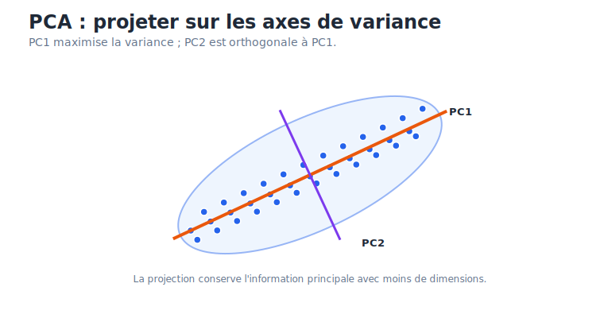

### Intuition mathématique

PCA cherche de nouveaux axes qui résument au mieux les données.

Étapes conceptuelles :

1. Standardiser les variables.
2. Étudier la covariance entre variables.
3. Trouver les directions principales.
4. Projeter les données sur ces directions.

Les directions sont les eigenvectors.

La quantité de variance expliquée par chaque direction est liée aux eigenvalues.

En pratique, les bibliothèques comme scikit-learn utilisent souvent la SVD pour calculer efficacement les composantes.

### Pourquoi standardiser

La PCA maximise la variance.

Si une variable a une échelle beaucoup plus grande que les autres, elle dominera artificiellement la PCA.

Exemple :

- `revenu` varie de 20 000 à 200 000.
- `taux_conversion` varie de 0 à 1.

Sans standardisation, PCA peut croire que le revenu est plus important juste parce que ses valeurs numériques sont plus grandes.

Règle :

```text
Toujours scaler avant PCA, sauf justification très claire.
```

### Scree plot et variance cumulée

Le scree plot montre la variance expliquée par chaque composante.

La variance cumulée montre la proportion totale d'information conservée en gardant les premières composantes.

En business, on garde souvent assez de composantes pour expliquer environ 70% à 90% de la variance, selon le contexte.

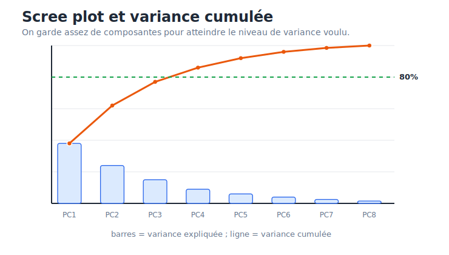

### Cercle de corrélation

Le cercle de corrélation montre comment les variables originales sont reliées aux composantes principales.

Interprétation :

- Flèches proches : variables corrélées positivement.
- Flèches opposées : variables corrélées négativement.
- Flèches à 90 degrés : variables peu corrélées.
- Flèche proche du bord : variable bien représentée par le plan PC1-PC2.

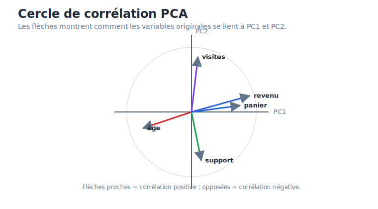

### Biplot

Un biplot combine :

- Les points projetés sur PC1-PC2.
- Les flèches des variables originales.

Il permet de comprendre pourquoi certains points sont proches : ils partagent des valeurs élevées ou faibles sur certaines variables originales.

### Applications

PCA est utile pour :

- Réduire le nombre de variables.
- Supprimer du bruit.
- Créer un score synthétique.
- Gérer la multicolinéarité.
- Visualiser rapidement un dataset.
- Prétraiter avant clustering.

Exemple :

```text
200 variables clients → 10 composantes principales → K-Means plus stable
```

### Limites de PCA

PCA est linéaire.

Elle marche bien si la structure importante est capturable par des axes linéaires.

Elle marche mal si les données vivent sur une forme non linéaire complexe, par exemple un Swiss roll.

Elle est aussi moins interprétable que les variables originales : une composante est une combinaison de plusieurs variables.

### Pièges d'examen sur PCA

- PCA ne fait pas de clustering.
- PCA maximise la variance, pas la séparation de classes.
- PCA doit généralement être précédée d'une standardisation.
- PC1 et PC2 sont orthogonales.
- Les composantes sont non corrélées.
- PCA est linéaire.
- Une forte variance n'est pas toujours synonyme d'information métier utile.

---

## 10. t-SNE et UMAP

### Pourquoi utiliser des méthodes non linéaires

PCA projette les données avec des axes linéaires.

Mais certains datasets ont une structure non linéaire :

- Manifold.
- Swiss roll.
- Groupes imbriqués.
- Relations courbes.

t-SNE et UMAP cherchent à produire une projection 2D ou 3D qui révèle cette structure.

### t-SNE

t-SNE signifie t-Distributed Stochastic Neighbor Embedding.

Son objectif principal :

```text
préserver les voisinages locaux
```

Il essaie de garder proches en 2D les points qui étaient voisins en haute dimension.

Pourquoi il sépare bien les clusters ?

t-SNE utilise une loi de Student à queues lourdes dans l'espace projeté. Cela aide à repousser les clusters et à éviter que tout soit compressé au centre.

Hyperparamètre clé :

`perplexity` :

- Approxime le nombre de voisins pris en compte.
- Faible perplexity : structure très locale.
- Haute perplexity : structure plus globale.

### Limites de t-SNE

Les distances globales ne sont pas fiables.

Si deux clusters sont éloignés sur le graphique, cela ne veut pas forcément dire qu'ils sont très éloignés dans les données originales.

Autres pièges :

- Résultats non déterministes si le random seed change.
- Densités visuelles trompeuses.
- Pas idéal comme preprocessing général.
- Surtout utile pour la visualisation 2D/3D.

### UMAP

UMAP signifie Uniform Manifold Approximation and Projection.

Il cherche à préserver la structure topologique des données.

Comparé à t-SNE :

- Souvent plus rapide.
- Préserve mieux la structure globale.
- Peut réduire vers plus de 2 ou 3 dimensions.
- Peut être utilisé comme preprocessing avant clustering.

Hyperparamètres importants :

`n_neighbors` :

- Contrôle le compromis local/global.
- Faible valeur : détails locaux.
- Grande valeur : structure globale.

`min_dist` :

- Contrôle à quel point les points sont compactés dans la projection.
- Faible : clusters serrés.
- Élevé : projection plus étalée.

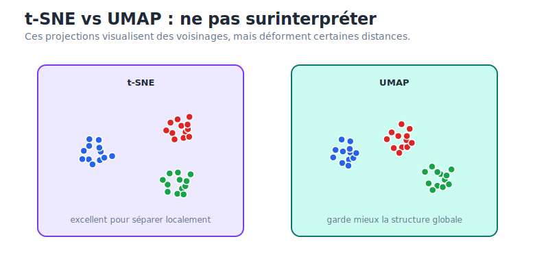

### Quand utiliser PCA, t-SNE ou UMAP

| Besoin | Méthode |
| --- | --- |
| Réduction linéaire, rapide, interprétable | PCA |
| Visualiser des clusters locaux en 2D | t-SNE |
| Visualiser et préserver davantage la structure globale | UMAP |
| Prétraitement avant clustering sur grand dataset | PCA ou UMAP |
| Expliquer les axes avec variance | PCA |

### Pièges d'examen sur t-SNE et UMAP

- t-SNE ne préserve pas bien les distances globales.
- t-SNE sert surtout à visualiser, pas à entraîner un modèle prédictif.
- UMAP est souvent plus scalable que t-SNE.
- `n_neighbors` dans UMAP contrôle le niveau de zoom local/global.
- `min_dist` contrôle la compacité des clusters dans la projection.
- Une belle visualisation 2D ne prouve pas qu'il existe de vrais clusters métier.

---

## 11. Détection d'anomalies

La détection d'anomalies cherche les observations rares ou inhabituelles.

Exemples :

- Fraude bancaire.
- Machine qui commence à tomber en panne.
- Bot traffic.
- Transaction anormale.
- Comportement utilisateur inhabituel.

Le problème est souvent très déséquilibré :

```text
anomalies < 1% des données
```

Donc l'accuracy est généralement inutile.

### Coût métier

Faux positif :

- Le modèle signale une anomalie alors que tout est normal.
- Coût : enquête inutile, alerte inutile, client bloqué.

Faux négatif :

- Le modèle rate une vraie anomalie.
- Coût : fraude non détectée, panne, risque opérationnel.

Le bon seuil dépend du coût relatif des FP et FN.

### Outlier detection vs novelty detection

Outlier detection :

- Les données d'entraînement peuvent contenir des anomalies.
- Cas réaliste et difficile.
- On cherche à isoler les points atypiques dans un dataset déjà pollué.

Novelty detection :

- Le modèle est entraîné sur des données propres.
- Ensuite, il détecte les nouvelles observations anormales.
- Cas idéal, par exemple un moteur sain observé pendant une longue période.

### Contamination

La contamination est l'estimation de la proportion d'anomalies dans les données.

Exemple :

```text
contamination = 0.01
```

signifie que l'on s'attend à environ 1% d'anomalies.

Ce paramètre influence le seuil de décision.

### Masking effect

Les anomalies peuvent déformer les statistiques classiques.

Exemple :

- Une moyenne peut être tirée vers les outliers.
- Une covariance peut être élargie par les outliers.

Résultat :

```text
Les anomalies peuvent se cacher en modifiant le centre et la dispersion calculés.
```

C'est pourquoi il faut des méthodes robustes.

---

## 12. One-Class SVM

### Intuition

One-Class SVM apprend une frontière autour des données normales.

On peut l'imaginer comme une enveloppe autour des observations habituelles.

Tout point en dehors de cette enveloppe est considéré comme anomalie.

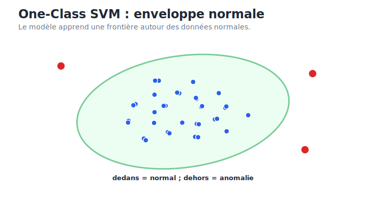

### Mécanisme

One-Class SVM utilise souvent un noyau RBF.

Le noyau permet de créer des frontières non linéaires complexes.

Il est adapté à la novelty detection lorsque les données d'entraînement sont propres ou presque propres.

### Hyperparamètres

`nu` :

- Contrôle la proportion maximale d'anomalies autorisées dans le train set.
- Contrôle aussi la souplesse de la frontière.

`gamma` :

- Contrôle l'influence locale des points avec le noyau RBF.
- Gamma élevé : frontière plus complexe.
- Gamma faible : frontière plus lisse.

### Quand l'utiliser

Utiliser One-Class SVM lorsque :

- Le dataset est petit ou moyen.
- Les données d'entraînement sont propres.
- On veut une frontière non linéaire.
- Le cas ressemble à de la novelty detection.

Éviter lorsque :

- Le dataset est très grand.
- Il y a beaucoup d'anomalies dans le train set.
- La dimension est très élevée.
- On a besoin d'un modèle très rapide.

---

## 13. Isolation Forest

### Intuition

Isolation Forest ne cherche pas à modéliser le normal.

Il cherche à isoler les anomalies.

Idée centrale :

```text
Les anomalies sont rares et différentes, donc faciles à isoler.
```

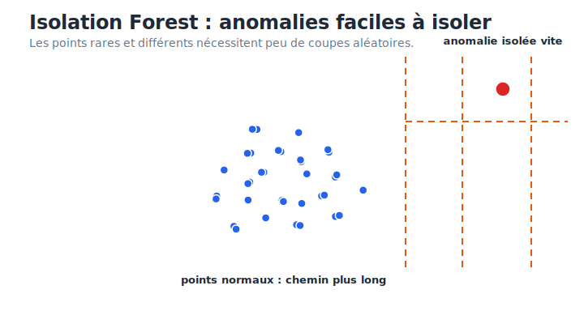

### Mécanisme

Le modèle construit beaucoup d'arbres avec des splits aléatoires.

Pour un point normal :

- Il est dans une zone dense.
- Il faut beaucoup de splits pour l'isoler.
- Sa longueur de chemin est longue.

Pour une anomalie :

- Elle est isolée dans une zone vide.
- Peu de splits suffisent.
- Sa longueur de chemin est courte.

### Pourquoi c'est puissant

Isolation Forest est souvent très pratique parce qu'il :

- Est rapide.
- Scale bien.
- Fonctionne en haute dimension mieux que beaucoup de méthodes basées sur la distance.
- Ne suppose pas une forme particulière de distribution.

### Hyperparamètres

`n_estimators` :

- Nombre d'arbres.

`contamination` :

- Proportion attendue d'anomalies.

`max_samples` :

- Nombre d'échantillons utilisés pour construire chaque arbre.

### Quand l'utiliser

Utiliser Isolation Forest lorsque :

- Le dataset est grand.
- On veut une méthode robuste et rapide.
- Les anomalies sont rares et différentes.
- On travaille sur logs, trafic web, bots, fraude, monitoring.

Piège :

Isolation Forest détecte bien les anomalies globales, mais peut rater certaines anomalies contextuelles locales.

---

## 14. Local Outlier Factor

### Intuition

LOF compare la densité locale d'un point à la densité locale de ses voisins.

Un point peut sembler normal globalement mais anormal localement.

Exemple :

- Dans une ville dense, un point un peu isolé peut être suspect.
- Dans une zone rurale, le même isolement peut être normal.

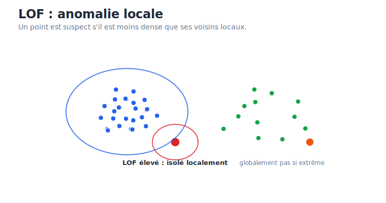

### Mécanisme

LOF regarde les `k` plus proches voisins.

Si un point a une densité similaire à celle de ses voisins :

```text
LOF ≈ 1
```

Il est normal.

Si un point est beaucoup moins dense que ses voisins :

```text
LOF >> 1
```

Il est suspect.

### Hyperparamètre principal

`n_neighbors` :

- Nombre de voisins utilisés pour définir le contexte local.
- Trop faible : modèle instable.
- Trop élevé : le modèle devient plus global et perd l'effet local.

### Quand l'utiliser

Utiliser LOF lorsque :

- Les anomalies sont contextuelles.
- La densité locale compte.
- Le dataset n'est pas trop grand.
- Les distances restent pertinentes.

Éviter lorsque :

- La dimension est très élevée.
- Le dataset est massif.
- Les données ne sont pas bien scaled.

---

## 15. Matrices de décision

### Clustering

| Situation | Bon choix | Pourquoi |
| --- | --- | --- |
| Clusters sphériques, dataset grand | K-Means | Simple, rapide, scalable |
| Besoin de probabilités | GMM | Soft clustering |
| Clusters elliptiques | GMM | Covariance flexible |
| Besoin d'un dendrogramme | Hiérarchique | Interprétable |
| Pas envie de choisir K avant | Hiérarchique ou DBSCAN | K choisi après ou inutile |
| Formes non linéaires + bruit | DBSCAN | Densité et noise |
| Densités variables | HDBSCAN | Plus robuste que DBSCAN |

### Réduction de dimensionnalité

| Situation | Bon choix | Pourquoi |
| --- | --- | --- |
| Réduction linéaire rapide | PCA | Simple, scalable |
| Variables corrélées | PCA | Crée des composantes non corrélées |
| Visualisation locale | t-SNE | Sépare bien les voisinages |
| Visualisation scalable | UMAP | Plus rapide et plus global |
| Préprocessing avant clustering | PCA ou UMAP | Réduit bruit et dimension |

### Détection d'anomalies

| Situation | Bon choix | Pourquoi |
| --- | --- | --- |
| Big data, logs, trafic web | Isolation Forest | Rapide et scalable |
| Données normales propres | One-Class SVM | Bonne novelty detection |
| Anomalies locales/contextuelles | LOF | Compare les densités locales |
| Haute dimension | Isolation Forest | Moins dépendant des distances |
| Besoin de frontière non linéaire | One-Class SVM | Noyau RBF |

---

## 16. Questions classiques d'examen

### Pourquoi K-Means est-il sensible au scaling ?

Parce qu'il utilise la distance euclidienne. Une variable avec une grande échelle numérique domine la distance, même si elle n'est pas plus importante métier.

Réponse courte :

```text
K-Means est distance-based, donc il faut standardiser les variables.
```

### Comment choisir K ?

On peut utiliser :

- Elbow plot avec l'inertie.
- Silhouette score.
- Interprétation métier.
- Stabilité des clusters.

Il n'y a pas toujours une réponse purement mathématique.

### Pourquoi l'inertie ne suffit-elle pas ?

Parce qu'elle diminue toujours quand `K` augmente.

Si `K = n`, chaque point peut devenir son propre cluster, et l'inertie devient presque nulle, mais le clustering n'a plus d'intérêt.

### Quelle est la différence entre K-Means et GMM ?

K-Means :

- Hard clustering.
- Centroïdes.
- Clusters plutôt sphériques.
- Distance euclidienne.

GMM :

- Soft clustering.
- Distributions gaussiennes.
- Formes elliptiques.
- Probabilités d'appartenance.

### Pourquoi DBSCAN n'a-t-il pas besoin de K ?

Parce qu'il ne cherche pas un nombre de centres.

Il identifie des régions denses connectées, puis considère les zones isolées comme du bruit.

### Pourquoi PCA nécessite-t-elle une standardisation ?

Parce que PCA maximise la variance. Sans scaling, les variables à grande échelle dominent artificiellement les composantes principales.

### PCA, t-SNE ou UMAP ?

PCA :

- Linéaire.
- Rapide.
- Utile pour réduction de variables et interprétation de variance.

t-SNE :

- Non linéaire.
- Très bon pour visualisation locale.
- Distances globales non fiables.

UMAP :

- Non linéaire.
- Plus rapide que t-SNE.
- Préserve souvent mieux la structure globale.

### Comment Isolation Forest détecte-t-il les anomalies ?

Il construit des arbres avec des splits aléatoires.

Les anomalies sont rares et isolées, donc elles demandent peu de splits pour être séparées.

Les points normaux sont dans des zones denses, donc ils demandent plus de splits.

### Quelle est la différence entre outlier detection et novelty detection ?

Outlier detection :

- Train set potentiellement pollué par des anomalies.
- Cas non supervisé réaliste.

Novelty detection :

- Train set propre.
- On détecte ensuite les nouveaux points anormaux.

---

## 17. Carte mentale finale

Clustering :

- K-Means : rapide, centroïdes, hard clustering, clusters sphériques.
- GMM : probabiliste, soft clustering, ellipses, EM algorithm.
- Hiérarchique : dendrogramme, choix de K après coup, linkage important.
- DBSCAN : densité, pas de K, bruit explicite, sensible à eps.

Réduction de dimensionnalité :

- Le fléau de la dimensionnalité rend les distances moins fiables.
- PCA maximise la variance sur des axes linéaires orthogonaux.
- PCA nécessite presque toujours une standardisation.
- t-SNE préserve surtout les voisinages locaux.
- UMAP est plus scalable et conserve souvent mieux la structure globale.

Détection d'anomalies :

- One-Class SVM apprend une frontière autour du normal.
- Isolation Forest isole rapidement les points rares et différents.
- LOF détecte les anomalies locales via comparaison de densité.
- Le seuil dépend du coût métier des faux positifs et faux négatifs.

